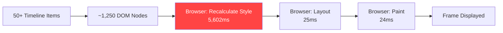
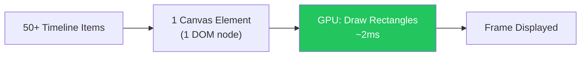
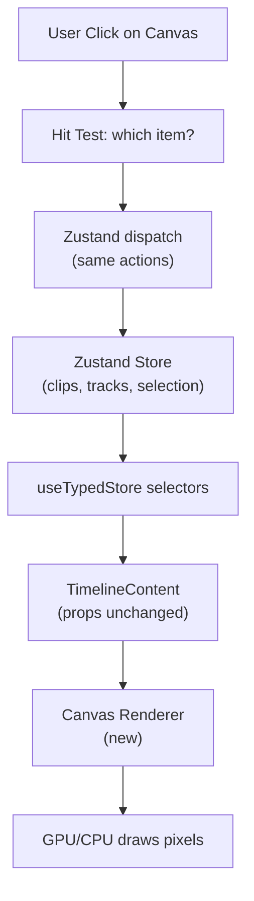
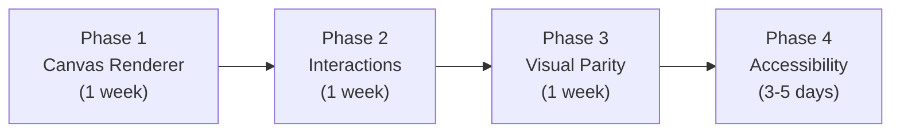
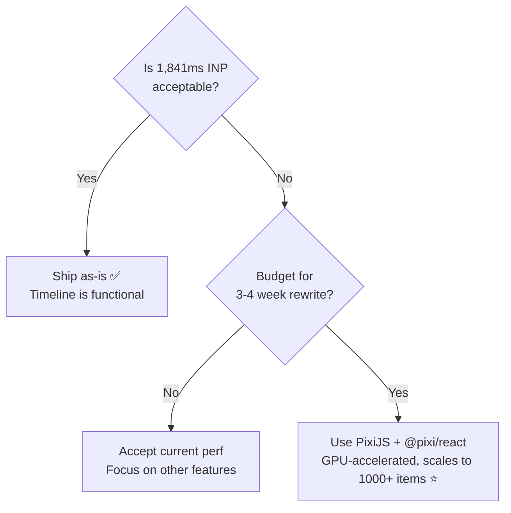

# Canvas-Based Timeline: Deep Dive Research

## Executive Summary

Canvas rendering eliminates the **Recalculate Style** bottleneck (currently 5,602ms / 47% of profile) by removing DOM elements entirely from the timeline rendering path. Items become pixels on a bitmap — the browser has nothing to style-recalculate.

| Approach          | Rendering Technology | INP Estimate | Effort    | React Compat         |
| ----------------- | -------------------- | ------------ | --------- | -------------------- |
| **PixiJS**        | WebGL (GPU)          | <30ms        | 3-4 weeks | Via `@pixi/react`    |
| **Konva**         | Canvas 2D (CPU)      | <50ms        | 2-3 weeks | Via `react-konva` ⭐ |
| **Fabric.js**     | Canvas 2D (CPU)      | <60ms        | 2-3 weeks | Manual               |
| **Raw Canvas 2D** | Canvas 2D (CPU)      | <50ms        | 4-6 weeks | Manual               |
| **WebGL direct**  | WebGL (GPU)          | <20ms        | 6-8 weeks | Manual               |

> [!IMPORTANT]
> **This is 100% client-side.** Canvas rendering is a browser feature — no server, no API, no cloud compute. The GPU on the user's machine does the work. Zero cost to you.

---

## 1. How Canvas Rendering Eliminates the Bottleneck

### The Current Problem



Every interaction triggers the browser to walk **all 1,250+ DOM nodes**, recompute their CSS properties, check inheritance, apply pseudo-classes, and resolve specificity. This happens on the **main thread** and blocks everything.

### Canvas Rendering Path



With canvas, the entire timeline is a single `<canvas>` DOM element. All items are drawn as colored rectangles, text, and shapes directly to a bitmap. The browser sees **1 DOM node** instead of 1,250+.

**Result:** Recalculate Style drops from 5,602ms → ~0ms. The GPU draws rectangles in microseconds.

---

## 2. Technology Comparison

### PixiJS (WebGL) — Best Performance

- **Rendering:** WebGL with Canvas 2D fallback
- **Performance:** 60-120 FPS with millions of sprites. GPU-accelerated parallel processing
- **React:** `@pixi/react` provides declarative JSX components
- **Hit Testing:** Built-in interactive object system with event bubbling
- **Key win:** GPU batches all draw calls into a single pass
- **Drawback:** WebGL contexts consume more memory (~2-4x vs Canvas 2D), overkill for simple rectangles

```tsx
// Example: PixiJS timeline item
<Container x={item.left} y={trackY}>
  <Graphics
    draw={(g) => {
      g.beginFill(item.color);
      g.drawRoundedRect(0, 0, item.width, 40, 4);
      g.endFill();
    }}
  />
  <Text text={item.label} style={labelStyle} />
</Container>
```

### Konva (Canvas 2D) — Best React Integration ⭐

- **Rendering:** Canvas 2D with layered canvases
- **Performance:** 60 FPS up to ~5,000 objects per layer (more than enough)
- **React:** `react-konva` provides idiomatic React components
- **Hit Testing:** Built-in with color-based picking (unique color per shape)
- **Key win:** Feels like writing normal React. Each shape is a React component
- **Drawback:** CPU-based, so slightly more main thread work than WebGL

```tsx
// Example: react-konva timeline item
<Group x={item.left} y={trackY} draggable>
  <Rect
    width={item.width}
    height={40}
    fill={item.color}
    cornerRadius={4}
    onMouseEnter={() => setCursor("grab")}
    onClick={() => selectItem(item.id)}
  />
  <Text text={item.label} fontSize={11} fill="white" padding={4} />
</Group>
```

### Fabric.js (Canvas 2D)

- **Rendering:** Canvas 2D with object model
- **Performance:** Good for interactive editors, ~60 FPS with hundreds of objects
- **React:** No official React binding; manual lifecycle management
- **Hit Testing:** Built-in with bounding box + pixel-perfect detection
- **Key win:** Strong object manipulation (great for the video preview canvas)
- **Drawback:** Heavier abstraction, designed more for image editing than timelines

### Raw Canvas 2D

- **Rendering:** Direct `ctx.fillRect()` / `ctx.fillText()` calls
- **Performance:** Fastest CPU-based option — no library overhead
- **React:** Manual. You manage the render loop yourself
- **Hit Testing:** Must implement manually (bounding box or hit canvas)
- **Key win:** Zero dependencies, total control
- **Drawback:** Must reimplement everything: events, drag, resize, tooltips, scrolling

---

## 3. Computation Costs

> [!NOTE]
> Canvas rendering is **entirely client-side**. The user's browser and GPU do all the work. There is zero server cost, zero API calls, zero cloud compute.

### Client-Side Performance

| Operation           | Canvas 2D (CPU)        | WebGL/PixiJS (GPU)      | DOM (Current)                  |
| ------------------- | ---------------------- | ----------------------- | ------------------------------ |
| Draw 100 rectangles | ~0.5ms                 | ~0.1ms                  | N/A (DOM nodes)                |
| Recalculate Style   | **0ms**                | **0ms**                 | 5,602ms                        |
| Hit test (click)    | ~0.01ms                | ~0.01ms                 | Built-in (DOM)                 |
| Re-render on scroll | ~1-2ms                 | ~0.5ms                  | ~50-200ms                      |
| Memory per item     | ~200 bytes (JS object) | ~200 bytes + GPU buffer | ~2-5KB (DOM nodes + listeners) |

### Memory Usage

| Approach           | 50 items              | 200 items             | 1,000 items            |
| ------------------ | --------------------- | --------------------- | ---------------------- |
| **DOM (current)**  | ~250KB                | ~1MB                  | ~5MB                   |
| **Canvas 2D**      | ~10KB + canvas buffer | ~40KB + canvas buffer | ~200KB + canvas buffer |
| **WebGL (PixiJS)** | ~50KB + GPU texture   | ~80KB + GPU texture   | ~250KB + GPU texture   |

Canvas buffer size = canvas width × height × 4 bytes (RGBA). At 1920×200px = ~1.5MB fixed regardless of item count.

### Power / Battery

- **Canvas 2D:** CPU renders at refresh rate (~16ms/frame). Idle when nothing changes — **no continuous draw loop needed**
- **WebGL:** GPU renders. Slightly more power than Canvas 2D during animation, but GPU is more efficient than CPU for graphics
- **Both:** Use `requestAnimationFrame` — only draw when needed. No spinning loop

---

## 4. Industry Case Studies

### CapCut (web.dev case study)

- **Architecture:** C++ rendering engine compiled to **WebAssembly** via Emscripten
- **Timeline:** Rendered via WebAssembly — not DOM-based
- **Video decode:** **WebCodecs** API with hardware-accelerated H.264/HEVC/VP9/AV1
- **Performance gain:** 300% improvement via WASM SIMD, 15% smaller bundles via WASM EH
- **Key insight:** Their timeline is NOT Canvas+JS — it's native C++ code running in the browser. This is a much larger investment than a JS canvas approach

### AG Grid (ag-grid.com)

- **Architecture:** Canvas 2D with scene graph abstraction for charts
- **Key technique:** Dirty flags — only redraw changed elements, not the entire canvas
- **OffscreenCanvas:** Uses Web Workers for rendering — main thread stays free
- **Result:** >1 million data points at 60+ FPS
- **Key insight:** Canvas eliminated DOM style recalculation entirely for their chart rendering

### Google Docs / Sheets

- **Architecture:** Canvas-based rendering since 2021 for the main document canvas
- **Reason:** DOM-based rendering couldn't handle rich text layout efficiently
- **Accessibility:** Maintains a hidden DOM tree that mirrors the canvas for screen readers

---

## 5. Integration with the Codebase

### What Would Change

| Component                                             | Current (DOM)                                | Canvas                                      | Change Required      |
| ----------------------------------------------------- | -------------------------------------------- | ------------------------------------------- | -------------------- |
| `timeline-content.tsx`                                | Renders `<MemoizedTimelineTrack>` per track  | Renders `<Stage>` with `<Layer>` per track  | **Major rewrite**    |
| `timeline-track.tsx`                                  | Maps items to `<MemoizedTimelineItem>`       | Draws rectangles per item                   | **Major rewrite**    |
| `timeline-item.tsx`                                   | 1,987 lines of DOM + event handlers          | Canvas shape with programmatic events       | **Replace entirely** |
| Timeline item content (thumbnails, waveforms, labels) | DOM children                                 | Canvas images + text drawing                | **Replace entirely** |
| Drag/Resize system                                    | DOM mouse events + `getBoundingClientRect()` | Canvas coordinate math                      | **Rewrite**          |
| Context menu                                          | Radix ContextMenu triggering                 | Manual right-click → position a DOM overlay | **Adapt**            |
| Transitions/Effects overlays                          | DOM elements with CSS opacity/blur           | Canvas drawn shapes                         | **Rewrite**          |
| Playhead indicator                                    | DOM absolute-positioned div                  | Canvas drawn line                           | **Trivial**          |
| Scroll/Zoom                                           | CSS transform + scale                        | Canvas viewport transform                   | **Rewrite**          |

### What Would NOT Change

- **Zustand store** — state management stays identical
- **Inspector panel** — remains DOM-based (it's not a bottleneck)
- **Video preview (Remotion)** — stays as-is
- **Track headers** — can remain DOM (only ~10 elements)
- **Timeline ruler** — can remain DOM or become Canvas
- **All business logic** — clip operations, snapping, transition calculations

### Data Flow (No Change)



---

## 6. Accessibility Considerations

> [!WARNING]
> Canvas elements are opaque to screen readers. Every canvas-based app that cares about accessibility maintains a **parallel hidden DOM** for assistive technology.

**Required approach:**

1. Maintain a hidden `<div aria-hidden="false">` that mirrors the canvas state
2. Each timeline item gets a hidden `<button>` or `<div role="listitem">` with `aria-label`
3. Keyboard navigation (arrow keys, Tab) works on the hidden DOM
4. Focus/selection state syncs between hidden DOM and canvas visual
5. Screen readers announce item labels, positions, and actions

This is how Google Docs, Canva, and Figma handle canvas accessibility—it's a known pattern but adds development overhead.

---

## 7. Recommended Approach: PixiJS + @pixi/react

### Why PixiJS Over Konva?

With **1,000+ timeline items** expected, PixiJS is the clear winner:

| Factor                     | PixiJS                                | Konva                                   |
| -------------------------- | ------------------------------------- | --------------------------------------- |
| Performance (1,000+ items) | **60-120 FPS** (GPU batching) ✅      | ~30-40 FPS (CPU strain) ⚠️              |
| Rendering                  | WebGL (GPU-accelerated)               | Canvas 2D (CPU)                         |
| React integration          | `@pixi/react` (declarative JSX)       | `react-konva` (slightly more idiomatic) |
| Learning curve             | Moderate — game engine paradigm       | Shallow — feels like React              |
| Memory                     | Higher (WebGL textures + GPU buffer)  | Lower (Canvas 2D)                       |
| Hit testing                | Built-in, event bubbling              | Built-in, color-based picking           |
| Scalability                | **Millions of sprites** at 60+ FPS    | ~5,000 objects per layer max            |
| Community/docs             | Excellent, heavily used in production | Excellent                               |

PixiJS's WebGL renderer batches all draw calls into a single GPU pass — the cost of rendering 100 items vs 1,000 items is nearly identical. Konva (Canvas 2D) processes each shape on the CPU sequentially, which becomes a bottleneck at scale.

### Phased Migration Strategy



**Phase 1 — Canvas Renderer (1 week)**

- Install `react-konva` and `konva`
- Create `CanvasTimeline` component replacing the track/item DOM tree
- Render colored rectangles with labels for each visible item
- Wire up Zustand store data → canvas props
- Result: Items appear, but no interaction

**Phase 2 — Interactions (1 week)**

- Click to select (Konva's built-in click events)
- Drag to move items (Konva's draggable prop)
- Resize handles (Konva transformer or custom)
- Context menu (Konva right-click → position DOM `<ContextMenu>`)
- Multi-selection (Shift+click, rubber band selection)

**Phase 3 — Visual Parity (1 week)**

- Waveform rendering on audio items (draw onto canvas)
- Video thumbnails (draw image strips)
- Transition overlays (gradient shapes)
- Status badges (canvas icons or pre-rendered sprites)
- Link group colors, selection glow, inactive opacity

**Phase 4 — Accessibility, QoL & Polish (COMPLETED)**

- Professional keyboard shortcuts (`use-canvas-keyboard.ts`): 30+ keybindings including JKL shuttle playback (Premiere/Resolve), frame stepping (←/→), edit point navigation (↑/↓), split at playhead (C), trim to playhead (Q/W), frame nudge (,/.), duplicate (D), copy/paste/cut (Ctrl+C/V/X), select all (Ctrl+A), tool switching (V=select, B=razor), snapping toggle (S/N), zoom (+/-/Shift+Z), undo/redo (Ctrl+Z/Y)
- Auto-scroll hook (`use-auto-scroll.ts`): RAF-based smooth scroll keeping playhead visible at ~30% from right edge during playback
- Clipboard hook (`use-clipboard.ts`): In-memory clip buffer preserving relative offsets between multi-selected clips
- ARIA mirror (`canvas-timeline-aria.tsx`): Hidden DOM `<ul role="listbox">` with descriptive `aria-label` per item (type, track, time range), `aria-selected`, and `aria-multiselectable`
- Canvas container ARIA: `role="application"`, `aria-label="Timeline editor"`, `tabIndex={0}`, `outline: none`
- Performance: `React.memo` wrappers on `CanvasTimelineItem` and `CanvasTimelineTrack`
- New props: `onZoomChange` and `onZoomToFit` callbacks on `CanvasTimelineProps`

### Total Estimated Effort

| Phase     | Effort         | Risk                                          |
| --------- | -------------- | --------------------------------------------- |
| Phase 1   | 5-7 days       | Low — straightforward rendering               |
| Phase 2   | 5-7 days       | Medium — complex interaction reimplementation |
| Phase 3   | 5-7 days       | Medium — visual fidelity matching             |
| Phase 4   | 3-5 days       | Low — known accessibility patterns            |
| **Total** | **~3-4 weeks** | **Medium overall**                            |

---

## 8. The Honest Trade-Offs

### What You Gain

- **INP drops from 1,841ms → <50ms** for any timeline interaction
- **Recalculate Style eliminated** (5,602ms → 0ms)
- **Scales to 1,000+ items** with zero performance degradation
- **Smoother scrolling, dragging, resizing** — everything is instant
- **Smaller DOM** = less memory, faster page load

### What You Lose

- **3-4 weeks of dev time** to rewrite the timeline
- **Native text selection gone** — must implement custom text handling
- **Browser DevTools inspection harder** — can't "inspect element" on canvas items
- **CSS utilities don't apply** — no Tailwind, no hover effects, must draw everything
- **Accessibility overhead** — must maintain parallel hidden DOM

### What Stays the Same

- Zustand store, actions, selectors — untouched
- Inspector panel, asset manager, video preview — untouched
- All business logic (snapping, transitions, effects) — untouched
- Track headers — can stay as DOM

---

## 9. Decision Framework



> [!TIP]
> You could also do a **hybrid approach**: keep DOM for track headers + context menus + inspector, use Canvas only for the item rendering area. This is the least risky migration path and still eliminates the Recalculate Style bottleneck.
