# Vid-Bolt Closed-Loop Video Generation System — Technical Design Report

> **Purpose:** Comprehensive reference for building the optimal closed-loop video production system within Vid-Bolt, derived from CoAgent's research. Designed for maximum robustness, speed, and performance. Foundation for a future implementation plan.

---

## 1. System Overview

### 1.1 Design Philosophy

The system has two distinct phases:

- **Open-Loop Creative Phase** — Humans make narrative decisions (outline, script, reference assets) with 3 review checkpoints
- **Closed-Loop Production Phase** — Specialized BullMQ workers autonomously generate, verify, and refine all visual/audio media with bidirectional communication

CoAgent's architecture naturally requires several distinct roles: planning, synthesis, verification, and memory management. These map to specialized BullMQ workers that communicate via structured message envelopes. A central **Orchestrator** worker manages global state, dispatches tasks, evaluates quality, and gates progression between phases.

### 1.2 Architecture Diagram

```mermaid
graph TB
    subgraph OPEN["📋 OPEN-LOOP — Human Creative Control"]
        direction LR
        OL1["1. Outline +<br/>Research<br/>✅ Human Review"]
        OL2["2. Script<br/>Writing<br/>✅ Human Review"]
        OL3["3. Reference Assets<br/>+ GCM Seed<br/>✅ Human Review"]
        OL1 --> OL2 --> OL3
    end

    OL3 -- "User clicks Start<br/>→ Wizard Step 3" --> ORCH

    subgraph CLOSED["🔁 CLOSED-LOOP — Hierarchical Agent System"]
        direction TB

        ORCH["🎬 ORCHESTRATOR<br/>orchestrator queue<br/>━━━━━━━━━━━━━━<br/>• State management<br/>• Quality gating<br/>• Phase progression<br/>• Dynamic prompt gen"]

        subgraph STEP0["Step 0: Initialization"]
            PROMPTS["Generate Dynamic<br/>Worker Prompts<br/>(Gemini 3 Flash)"]
            GCM["Load GCM<br/>Entities"]
            PERSIST_PROMPTS["Save to<br/>video_projects.worker_prompts"]
        end

        subgraph PHASE1["Phase I: TTS Foundation"]
            TTS["🎙️ TTS Agent<br/>tts queue (no GPU)<br/>━━━━━━━━━━━━━━<br/>InWorld API<br/>→ audio + word timestamps"]
            TTS_STORE["💾 R2: audio file<br/>💾 metadata: timestamps"]
        end

        subgraph PHASE2["Phase II: Shot Planning"]
            SHOT_PLAN["📋 Shot Planner<br/>shot-planner queue<br/>━━━━━━━━━━━━━━<br/>• Temporal mapping via TTS<br/>• Media type assignment<br/>• Content type tagging<br/>• MG asset declaration<br/>• Entity tagging"]
            SHOT_STORE["💾 metadata.shot_plan<br/>{shots[], content_types}"]
        end

        subgraph PHASE3["Phase III: Asset Retrieval"]
            ASSET["🔍 Asset Scout<br/>asset-scout queue<br/>━━━━━━━━━━━━━━<br/>• Serper image scraping<br/>• AI prompt generation<br/>• SFX search Freesound"]
            ASSET_STORE["💾 metadata: prompts,<br/>scraped_stock_images,<br/>sfx_manifest"]
        end

        subgraph PHASE4["Phase IV: Production"]
            direction TB

            subgraph GPU["🖥️ GPU Pipeline (Sequential VRAM)"]
                direction TB

                subgraph IMG_PIPE["Image Pipeline"]
                    IMG_GEN["🖼️ Image Gen<br/>image-gen queue<br/>Z-Image Turbo<br/>(VRAM: image_generation)"]
                    IMG_VERIFY["🔍 Verifier<br/>Gemini 3 Flash<br/>━━━━━━━━━━<br/>2 retries + backoff<br/>5 dimensions scored"]
                    IMG_RESULT{"PASS?"}
                    IMG_FAIL_TYPE{"Failure<br/>type?"}
                    IMG_RETRY["Re-gen<br/>(fundamental)<br/>or Re-edit<br/>(recoverable)"]
                    IMG_SALVAGE["Best-Fit<br/>Salvage<br/>(3 fails)"]
                    IMG_SAVE["💾 R2 + metadata:<br/>generated_images"]

                    IMG_GEN --> IMG_VERIFY --> IMG_RESULT
                    IMG_RESULT -- "YES" --> IMG_SAVE
                    IMG_RESULT -- "NO" --> IMG_FAIL_TYPE
                    IMG_FAIL_TYPE -- "recoverable" --> IMG_RETRY
                    IMG_FAIL_TYPE -- "fundamental" --> IMG_RETRY
                    IMG_FAIL_TYPE -- "3x failed" --> IMG_SALVAGE
                    IMG_RETRY --> IMG_VERIFY
                    IMG_SALVAGE --> IMG_SAVE
                end

                subgraph VID_PIPE["Video Pipeline"]
                    VID_GEN["🎥 Video Gen<br/>video-gen queue<br/>LTX-2 19B (batch)<br/>(VRAM: video_generation)"]
                    VID_VERIFY["🔍 Verifier<br/>per-shot verify"]
                    VID_RESULT{"PASS?"}
                    VID_FUND{"fundamental?"}
                    VID_RETRY["1 retry<br/>(GPU re-gen)"]
                    VID_FLAG["Flag shot<br/>+ use anyway"]
                    VID_SAVE["💾 R2 + metadata:<br/>generated_videos"]

                    VID_GEN --> VID_VERIFY --> VID_RESULT
                    VID_RESULT -- "YES" --> VID_SAVE
                    VID_RESULT -- "NO" --> VID_FUND
                    VID_FUND -- "YES + not retried" --> VID_RETRY --> VID_VERIFY
                    VID_FUND -- "NO or retried" --> VID_FLAG --> VID_SAVE
                end

                IMG_PIPE --> VID_PIPE
            end

            subgraph MG_CPU["🎨 MG Pipeline (CPU, parallel with GPU)"]
                direction TB
                MG_PASS1["MG Pass 1<br/>motion-graphics queue<br/>━━━━━━━━━━━━━━<br/>Gemini → Remotion code<br/>→ Chromium render<br/>→ Gemini verify<br/>→ iterate until verified<br/>(placeholder:// URLs)"]
                MG_PERSIST1["💾 metadata:<br/>generated_motion_graphics<br/>(with placeholders)"]
                MG_PASS1 --> MG_PERSIST1
            end
        end

        subgraph SWAP["🔗 MG Pass 2: Asset Swap"]
            MG_SWAP["Replace placeholder://URLs<br/>with real R2 URLs<br/>━━━━━━━━━━━━━━<br/>• Match by nearest segment_index<br/>• Include scraped stock images<br/>• Include generated videos/images<br/>• Syntax validation only"]
            MG_PERSIST2["💾 metadata:<br/>generated_motion_graphics<br/>(with real URLs)"]
            MG_SWAP --> MG_PERSIST2
        end

        subgraph PHASE5["Phase V: Auto-Assembly"]
            EDIT["✂️ Edit Assembly<br/>edit-assembly queue<br/>━━━━━━━━━━━━━━<br/>• Chunked LLM generation<br/>• Content-type aware pacing<br/>• Emotional pacing zones<br/>• Ken Burns variation<br/>• SFX track placement<br/>• Overlay sync by shotIndex"]
            MERGE["Merge EDL Chunks<br/>━━━━━━━━━━━━━━<br/>• Rebuild main-video timing<br/>• Sync overlays by shotIndex<br/>• Batch context continuity<br/>• Dedup transitions"]
            FALLBACK["Fallback EDL<br/>━━━━━━━━━━━━━━<br/>• Content-aware transitions<br/>• Varied Ken Burns (4 patterns)<br/>• SFX track included"]
            EDL_SAVE["💾 metadata.edl<br/>+ Video Editor V2 state"]

            EDIT --> MERGE --> EDL_SAVE
            EDIT -. "LLM JSON error" .-> FALLBACK --> EDL_SAVE
        end

        %% Main flow connections
        ORCH --> STEP0
        STEP0 --> PHASE1
        PHASE1 --> PHASE2
        PHASE2 --> PHASE3
        PHASE3 --> PHASE4
        GPU --> |"await Promise.all"| SWAP
        MG_CPU --> |"await Promise.all"| SWAP
        SWAP --> PHASE5

        %% Data flow connections
        TTS --> TTS_STORE
        SHOT_PLAN --> SHOT_STORE
        ASSET --> ASSET_STORE

        %% Cross-phase data flow
        TTS_STORE -. "word timestamps" .-> SHOT_PLAN
        SHOT_STORE -. "shot plan + content types" .-> ASSET
        ASSET_STORE -. "prompts + stock URLs" .-> IMG_GEN
        ASSET_STORE -. "prompts" .-> VID_GEN
        SHOT_STORE -. "MG shot specs" .-> MG_PASS1
        IMG_SAVE -. "real URLs" .-> MG_SWAP
        VID_SAVE -. "real URLs" .-> MG_SWAP
        ASSET_STORE -. "stock URLs" .-> MG_SWAP
        SHOT_STORE -. "content types<br/>+ section breaks" .-> EDIT
    end

    EDL_SAVE --> EDITOR

    subgraph FINAL["👤 FINAL REVIEW — Human"]
        EDITOR["Video Editor V2<br/>✅ Manual Tweaks"]
        RENDER["Remotion Lambda<br/>Final Export"]
        EDITOR --> RENDER
    end

    %% Styling
    classDef orchestrator fill:#4338ca,stroke:#312e81,color:#fff
    classDef gpu fill:#dc2626,stroke:#991b1b,color:#fff
    classDef cpu fill:#059669,stroke:#065f46,color:#fff
    classDef verify fill:#d97706,stroke:#92400e,color:#fff
    classDef store fill:#6b7280,stroke:#374151,color:#fff
    classDef human fill:#2563eb,stroke:#1e40af,color:#fff

    class ORCH orchestrator
    class IMG_GEN,VID_GEN gpu
    class MG_PASS1,MG_SWAP cpu
    class IMG_VERIFY,VID_VERIFY verify
    class TTS_STORE,SHOT_STORE,ASSET_STORE,IMG_SAVE,VID_SAVE,MG_PERSIST1,MG_PERSIST2,EDL_SAVE,PERSIST_PROMPTS store
    class OL1,OL2,OL3,EDITOR,RENDER human
```



### 1.3 Tech Stack

| Component          | CoAgent (Paper)    | Vid-Bolt (Target)                              |
| ------------------ | ------------------ | ---------------------------------------------- |
| Orchestration      | Custom multi-agent | **BullMQ + Redis** (existing)                  |
| Storyboard Planner | Gemini 2.5 Flash   | **Gemini 3 Flash**                             |
| Video Backbone     | Wan2.1             | **LTX-2 19B**                                  |
| Image Generation   | —                  | Z-Image Turbo                                  |
| Image Editing      | —                  | Qwen-Image-Edit-2511                           |
| Verifier Agent     | GPT-4o             | **Gemini 3 Flash**                             |
| GCM Visual Encoder | Unspecified        | **CLIP ViT-L/14** (stock image classification) |
| Music              | —                  | ACE-Step 1.5                                   |
| SFX                | —                  | **Freesound API** (stock SFX search)           |
| Motion Graphics    | —                  | **Remotion** (on per-user VM CPU)              |
| Video Editor       | —                  | **Video Editor V2** (programmatic state API)   |
| Final Render       | —                  | **Remotion Lambda**                            |
| Storage            | —                  | Cloudflare R2                                  |

---

## 2. Specialized Workers

### 2.1 Orchestrator

**Role:** Central coordinator — state management, quality gating, and phase progression.

**Responsibilities:**

- **Context Management:** Holds the "Creative Manifest" — user preferences, locked script, TTS data, style guide, and the **Global Context Manager (GCM)** entity memory
- **Decision Logic:** Evaluates each sub-agent's output against a "Definition of Done"
- **Feedback Synthesis:** Generates "Delta Instructions" — structured JSON identifying the exact gap between output and goal
- **Fallback Handling:** Max-retry logic (3 attempts). On attempt #3 failure, performs "Best-Fit Salvage" (accepts best result, flags for human review)
- **Phase Gating:** Must verify each phase output before the next begins
- **Dynamic Prompt Generation:** At the start of each video, generates optimized system prompts for all workers tailored to that specific video and user (see §3)

**BullMQ Implementation:** Primary worker on the `orchestrator` queue. Dispatches jobs to specialized worker queues and evaluates their responses.

### 2.2 Shot Planner Worker

**Role:** Storyboarding, structural logic, and temporal mapping.

**Responsibilities:**

- **Temporal Mapping:** Analyzes TTS timestamps to compute shot durations
- **Asset Allocation:** Assigns media types per shot (Stock, AI Image, AI Video, Motion Graphic) based on the Creative Manifest's weighting rules
- **Narrative Pacing:** Ensures visual rhythm matches audio tone (fast cuts for energy, slow holds for emotional beats)
- **Entity Tagging:** Each shot plan includes referenced entity IDs from the GCM for downstream retrieval
- **Synthesis Mode Assignment:** Selects T2V / FF2V per shot based on entity overlap and scene transitions. FLF2V is assigned sparingly (see §6).
- **Motion Graphics Asset Declaration:** Identifies composite-tier motion graphic shots and declares their required sub-images so they can be included in the Phase C image batch

**BullMQ Implementation:** Worker on the `shot-planner` queue. Receives the locked script + **TTS timestamps + word-level timing data**, produces a structured JSON shot plan with each shot aligned to narration segments.

### 2.3 Asset Scout Worker

**Role:** Resource retrieval, prompt engineering, and GCM-aware asset preparation.

**Responsibilities:**

- **Image Scraping (Serper):** Uses the existing Serper image search pipeline (`lib/serper/`) to find reference/stock images. Queries with semantic keywords extracted from shot descriptions. **Images only** — no stock video or yt-dlp.
- **SFX Search (Freesound API):** Searches Freesound API for CC0 sound effects matching shot descriptions. Ranks results by relevance, downloads best match, maps to timeline positions based on TTS timestamps.
- **Visual Prompting:** Writes detailed image/video generation prompts enriched with GCM entity descriptions and style guide constraints from the Creative Manifest
- **GCM Integration:** Retrieves canonical reference images from the GCM and includes them as conditioning context for prompts
- **Metadata Validation:** Checks scraped image resolution and aspect ratio against project requirements. Rejects mismatches automatically.
- **Asset Manifest:** Produces a structured manifest mapping each shot to its asset source (scraped image URL, AI prompt, SFX URL, or motion graphic spec)

**Serper Image Scraping Flow:**

```
For each shot in approved plan:
  1. Check if shot.media_type == 'stock'
  2. Extract semantic keywords from shot description
  3. Query Serper image search with keywords
  4. Rank results by relevance to shot description
  5. If good match found → use scraped image (with Ken Burns in timeline)
  6. If no good match → flag shot, suggest switching to AI generation
  7. Return asset manifest to Orchestrator for review
```

**SFX Search Flow:**

```
For each shot needing sound effects:
  1. Extract SFX keywords from shot description + TTS content
  2. Query Freesound API with semantic search terms
  3. Filter by license (CC0 preferred), duration, quality
  4. Rank by relevance, download best match to R2
  5. Map SFX clip to precise timeline position based on TTS timestamps
  6. Return SFX manifest to Orchestrator
```

### 2.4 Image Generation Agent

**Role:** Specialized in Z-Image Turbo prompting and keyframe generation.

**Responsibilities:**

- Translates Asset Scout prompts into Z-Image-optimized API calls
- Enriches prompts with GCM entity descriptions, style attributes, and model-specific keywords (Z-Image does not support negative prompts — all constraints must be embedded in the positive prompt)
- Manages batch image generation with consistent style across all keyframes
- Generates composite-tier motion graphic sub-images (declared by Shot Planner) in the same image batch

**BullMQ Implementation:** Worker on the `image-gen` queue. VRAM mode: `image_generation`.

### 2.5 Image Editing Agent

**Role:** Specialized in Qwen-Image-Edit-2511 prompting and GCM-guided style edits.

**Responsibilities:**

- Takes generated keyframes and applies GCM-guided consistency edits (hair color, clothing, lighting)
- Crafts Qwen-Edit-specific instruction prompts (different syntax than generation prompts)
- Manages LoRA selection for style-specific edits
- Validates edited images against GCM canonical references before submitting

**BullMQ Implementation:** Worker on the `image-edit` queue. VRAM mode: `image_editing`.

### 2.6 Video Generation Agent

**Role:** Specialized in LTX-2 prompting and synthesis mode management.

**Responsibilities:**

- Crafts LTX-2-optimized motion prompts (camera movement, temporal descriptions)
- Manages synthesis mode selection (T2V / FF2V / FLF2V) and escalation on failure
- **Frame Extraction:** Extracts last frames from verified shots for FF2V/FLF2V conditioning. Requires a frame extraction utility that: (1) downloads generated video from R2, (2) uses FFmpeg to extract the last frame, (3) uploads extracted frame to R2, (4) returns the R2 URL for use as `start_frame_url` in the next shot. **This utility must be built as a prerequisite for FF2V/FLF2V modes.**
- Handles sequential generation order (temporal dependencies between shots)

**BullMQ Implementation:** Worker on the `video-gen` queue. VRAM mode: `video_generation`.

### 2.7 Motion Graphics Agent

**Role:** Remotion composition design and self-contained verification. Runs on the **per-user GCP VM CPU** (g4-standard-48: 48 vCPUs, 180GB RAM, AMD Turin) via API, enabling **parallel execution alongside GPU-bound image/video generation**.

**Responsibilities:**

- Designs Remotion composition code for each motion graphic shot (kinetic text, charts, infographics, overlays, montages)
- Classifies each motion graphic into a complexity tier to determine asset needs
- Uses the **two-pass single-request pattern** — each pass is one API call to the GPU VM, which handles the entire generate→render→verify loop internally

**Composition Tiers:**

| Tier                  | Type                                     | Assets Needed                              | Example                                                         |
| --------------------- | ---------------------------------------- | ------------------------------------------ | --------------------------------------------------------------- |
| **Self-contained**    | Text/data only                           | None                                       | Kinetic typography, animated chart, lower third                 |
| **Reference-overlay** | Overlays on existing media               | Video/image from other agents              | Crime board connecting images, annotated footage                |
| **Composite**         | Builds new visuals from generated assets | Images declared by Shot Planner (Phase II) | Character montage, animated photo collage, illustrated timeline |

**Single-Request Pattern (GPU VM handles full loop internally):**

Vid-Bolt sends **one request** per motion graphic shot containing all context (shot spec, style rules, GCM entity data, asset map). The GPU VM handles the entire Gemini generation → Chromium rendering → Gemini verification loop internally. Screenshots stay **in memory as base64** — never uploaded to R2. Only the final verified **Remotion composition code** is returned.

```
Vid-Bolt → GPU VM API:
  POST /api/motion-graphics/generate
  {
    shot_spec: { description, type, duration_frames },
    style_rules: { visual_style, color_palette, typography },
    entity_context: [ { id, description, reference_url } ],
    assets: { "img-shot-003": "placeholder" | "https://r2..." },
    dimensions: { width: 1920, height: 1080 },
    max_retries: 3
  }

GPU VM (self-contained loop, all in-memory):
  1. Gemini 3 Flash → generates Remotion composition code
  2. Headless Chromium → renders composition → screenshot as base64 (in memory)
  3. base64 screenshot → Gemini 3 Flash verification (no disk, no R2)
  4. If FAIL → Gemini revises code with feedback → re-render → re-verify
  5. Loop until PASS or max_retries exceeded
  6. Return ONLY final composition code via webhook:
     { composition_code: "...", iterations: 2, status: "verified" }
```

**Two-Pass Execution:**

- **Pass 1** (parallel with Phase C/D): Vid-Bolt sends request with `assets: "placeholder"`. GPU VM generates and verifies **layout structure** with placeholder rectangles. Returns verified composition code.
- **Pass 2** (after Phase C/D): Vid-Bolt sends a second request with the **same composition code** but `assets` updated to real R2 URLs. GPU VM re-renders and does a quick visual check with real assets. Returns final composition code.

> [!NOTE]
> Pass 1 is effectively **free compute** — the 48 VM CPU cores are idle while the GPU renders images/videos. All motion graphic compositions can be processed in parallel during this time. No screenshots are ever stored — the Video Editor V2 renders previews on-demand from the returned composition code.

**Composite-Tier Image Handling:** Composite-tier images are **declared by the Shot Planner during Phase II** and **generated as part of the Phase C image batch** alongside all other keyframes. This avoids late-stage VRAM switching. The Motion Graphics Agent simply references these images by asset ID in its compositions.

**BullMQ Implementation:** Worker on the `motion-graphics` queue. No GPU needed (CPU/browser rendering on VM). Vid-Bolt assembles the request payload (customization), GPU VM executes the loop (rendering + verification).

### 2.8 TTS Agent

**Role:** Text optimization for TTS APIs and narration consistency checking.

**Responsibilities:**

- Optimizes script text for TTS input (pronunciation hints, SSML markers, pacing cues)
- Submits to TTS provider which returns audio + **forced-alignment word-level timestamps** (already extremely accurate from the provider)
- **Audio normalization:** Normalizes all TTS clips to a target LUFS level (e.g., -16 LUFS) so volume stays consistent across multiple generation calls
- Checks audio consistency across multiple TTS requests (voice tone, pacing uniformity)
- Handles voice selection and emphasis markers

> [!IMPORTANT]
> **TTS is generated FIRST in the closed loop.** The Shot Planner needs the provider-returned word-level timestamps to align shots with narration pacing.

**BullMQ Implementation:** Worker on the `tts` queue. No GPU needed (external TTS API).

### 2.9 Music Agent

**Role:** Specialized in ACE-Step 1.5 prompting for background music.

**Responsibilities:**

- Analyzes script mood/tone via Gemini 3 Flash to craft ACE-Step-optimized prompts
- Generates 2–3 music variants for Orchestrator selection
- Produces audio mixing metadata (ducking rules, crossfade timings, volume envelopes)
- **Multi-segment generation:** For videos longer than 90 seconds, generates music in overlapping 90–120 second segments with consistent seed/prompt parameters. Uses audio crossfading to join segments seamlessly. ACE-Step quality is most consistent at 90–120 second durations; longer single generations may produce inconsistent sections.

**BullMQ Implementation:** Worker on the `music` queue. VRAM mode: `audio_creation`.

### 2.10 SFX Agent

**Role:** Stock sound effect search and curation via Freesound API.

**Responsibilities:**

- Identifies moments needing sound effects from the shot plan and TTS content
- Crafts semantic search queries from shot descriptions and script context
- Searches Freesound API for matching sound effects (filter by CC0 license, duration, quality)
- Ranks results by relevance, downloads best match to R2
- Maps SFX clips to precise timeline positions based on TTS timestamps

> [!NOTE]
> SFX uses stock audio search rather than AI generation. This provides higher audio quality (44.1kHz/48kHz vs 16kHz), commercially-safe CC0 licensing, and no GPU requirement. SFX search runs during Phase III (Asset Retrieval) alongside the Asset Scout.

**BullMQ Implementation:** Worker on the `sfx` queue. No GPU needed (Freesound API search).

---

## 3. Dynamic Prompt Generation ("Hiring Optimized Workers")

### 3.1 Concept

Each user has a **User System Prompt** stored in their profile — their preferences for video style, tone, pacing, and creative direction. When the closed loop starts, the **Orchestrator** reads the user's system prompt + the specific video's Creative Manifest and generates **tailored system prompts for each worker**, optimized for that exact video.

This is analogous to the Orchestrator "hiring" specialists — it creates the best possible instructions for each worker based on the intersection of user preferences and video requirements.

### 3.2 Prompt Chain

```
User System Prompt (stored in profile, editable)
  │  "I make dark, cinematic tech explainers. Fast pacing.
  │   Heavy use of motion graphics for data. Minimal stock."
  │
  ▼
Orchestrator receives: User Prompt + Script + Reference Assets + Creative Manifest
  │
  ├──▶ Generates Shot Planner prompt
  ├──▶ Generates Asset Scout prompt (Serper image + Freesound SFX keywords)
  ├──▶ Generates Image Gen Agent prompt (Z-Image style keywords)
  ├──▶ Generates Image Edit Agent prompt (Qwen-Edit instructions)
  ├──▶ Generates Video Gen Agent prompt (LTX-2 motion descriptors)
  ├──▶ Generates Motion Graphics Agent prompt (Remotion style rules)
  ├──▶ Generates Music Agent prompt (ACE-Step genre/tempo)
  └──▶ Generates SFX Agent prompt (Freesound search keywords)
```

### 3.3 Agent System Prompt Reference

All dynamically generated prompts are built by [`prompt-generator.ts`](file:///c:/Users/owen/Desktop/Projects/Vid-Bolt/web/lib/services/prompt-generator.ts). Two agents (Verifier, Edit Assembly) have hardcoded prompts.

| Agent               | Prompt Source                                                                                                                                                 | Key Injections from Manifest / GCM                                                                                                                                                                                                                                  |
| ------------------- | ------------------------------------------------------------------------------------------------------------------------------------------------------------- | ------------------------------------------------------------------------------------------------------------------------------------------------------------------------------------------------------------------------------------------------------------------- |
| **Shot Planner**    | `buildShotPlannerPrompt()`                                                                                                                                    | `visual_style`, `aspect_ratio`, `lighting_mood`, media weighting %, pacing rules (hook duration, max static images, min video/min), full GCM entity list with IDs + descriptions                                                                                    |
| Agent               | Prompt Source                                                                                                                                                 | Key Injections from Manifest / GCM                                                                                                                                                                                                                                  |
| ------------------- | ---------------------------------------------------------------------------------------------------------------------------------------------                 | ------------------------------------------------------------------------------------------------------------------------------------------------------------------------------------------------------------------------------------------------------------------- |
| **Shot Planner**    | `buildShotPlannerPrompt()`                                                                                                                                    | `visual_style`, `aspect_ratio`, `lighting_mood`, media weighting %, pacing rules (hook duration, max static images, min video/min), full GCM entity list with IDs + descriptions                                                                                    |
| **Asset Scout**     | `buildAssetScoutPrompt()`                                                                                                                                     | `visual_style`, `color_palette`, `lighting_mood`, GCM entities with `reference_url` and `text_description`                                                                                                                                                          |
| **Image Gen**       | `buildImageGenPrompt()`                                                                                                                                       | `visual_style`, `aspect_ratio`, quality anchors (default: `photorealistic, cinematic, 4K, film grain`), constraints (`no text, no watermark, no logos`)                                                                                                             |
| **Video Gen**       | `buildVideoGenPrompt()`                                                                                                                                       | `visual_style`, `aspect_ratio`, synthesis mode rules (T2V / FF2V), camera movement instructions                                                                                                                                                                     |
| **Motion Graphics** | `buildMotionGraphicsPrompt()`                                                                                                                                 | `visual_style`, MG theme (dark/light/colorful/minimal), MG color palette, animation style (smooth/bouncy/snappy/gentle)                                                                                                                                             |
| **Music**           | `buildMusicPrompt()`                                                                                                                                          | `visual_style` (for mood matching), `lighting_mood`, segmentation rules (90-120s for long videos), ducking                                                                                                                                                          |
| **SFX**             | `buildSfxPrompt()`                                                                                                                                            | `visual_style` (for mood matching), CC0 license filter, timeline positioning rules                                                                                                                                                                                  |
| **Verifier**        | Hardcoded in [`verifier.ts`](file:///c:/Users/owen/Desktop/Projects/Vid-Bolt/web/lib/queues/workers/verifier.ts) (L50-120)                                    | N/A — uses 5-dimension scoring (semantic alignment, entity consistency, temporal continuity, visual quality, style consistency). Images: strict (generic scenes = fundamental FAIL). Videos: lenient (subtle artifacts = PASS). 2 retries with exponential backoff. |
| **Edit Assembly**   | Hardcoded in [`edit-assembly-prompts.ts`](file:///c:/Users/owen/Desktop/Projects/Vid-Bolt/web/lib/services/edit-assembly/edit-assembly-prompts.ts) (L106-185) | N/A — uses documentary style defaults (4-8s cuts), emotional pacing zones per `[content_type]` tag, Ken Burns variation (4 patterns), color grading guidance, SFX track placement, hybrid shot rules. Receives 150-char narration preview per shot.                 |

> [!NOTE]
> The Verifier and Edit Assembly agents are **not** dynamically generated — their prompts are hardcoded since they enforce structural quality rules that should remain consistent regardless of user style. All other agents receive personalized prompts blending the user's creative direction with the Creative Manifest.

### 3.4 Storage

| Data                         | Location                                   | Editable By                                |
| ---------------------------- | ------------------------------------------ | ------------------------------------------ |
| **User System Prompt**       | `user_profiles.system_prompt` (Supabase)   | User (via settings UI)                     |
| **Per-Video Worker Prompts** | `video_projects.worker_prompts` (JSONB)    | Orchestrator (auto-generated)              |
| **Creative Manifest**        | `video_projects.creative_manifest` (JSONB) | User (via project settings) + Orchestrator |

### 3.5 Why This Works

- **Personalization at scale:** Every user gets videos that match their unique style without manual prompt engineering per shot
- **Consistency:** All workers share a unified vision derived from the same user prompt, so styles don't clash
- **Iteration:** Users can refine their system prompt over time, and all future videos benefit
- **No prompt leakage between users:** Each worker's system prompt is generated fresh per project

---

## 4. Agent Communication Protocol

### 4.1 Message Envelope

All inter-agent communication uses a structured JSON envelope routed through BullMQ:

```json
{
  "envelope_id": "env-uuid-001",
  "from": "orchestrator",
  "to": "shot_planner",
  "action": "GENERATE | REVISE | APPROVE | REJECT | ESCALATE",
  "phase": "shot_planning | asset_retrieval | production | audio | assembly",
  "iteration": 1,
  "project_id": "proj-uuid",
  "context": {
    "creative_manifest_ref": "manifest-uuid",
    "gcm_ref": "gcm-uuid",
    "locked_script_ref": "script-uuid"
  },
  "payload": {},
  "delta_feedback": {
    "target_id": "shot-004",
    "issue": "Visual is too bright for the 'Horror' theme.",
    "instruction": "Update prompt: add 'low-key lighting, volumetric fog, dark shadows'.",
    "verdict": "FAIL",
    "failure_type": "recoverable",
    "dimension_feedback": {
      "semantic_alignment": "Scene matches description well.",
      "entity_consistency": "Hair color mismatch — host should have brown hair per reference.",
      "style_consistency": "Too bright for dark cinematic style guide."
    }
  },
  "context_locked": true,
  "timestamp": "2026-02-07T19:50:00Z"
}
```

### 4.2 Action Types

| Action     | Direction            | Description                                          |
| ---------- | -------------------- | ---------------------------------------------------- |
| `GENERATE` | Orchestrator → Agent | Initial task assignment                              |
| `REVISE`   | Orchestrator → Agent | Feedback-driven regeneration with delta instructions |
| `APPROVE`  | Orchestrator → Agent | Output meets Definition of Done                      |
| `SUBMIT`   | Agent → Orchestrator | Output ready for review                              |
| `REQUEST`  | Agent → Agent        | Sub-request (e.g., Motion Graphics → Image Gen)      |
| `ESCALATE` | Orchestrator → Agent | Change strategy (e.g., T2V → FF2V mode switch)       |
| `FLAG`     | Orchestrator → User  | Max retries exceeded, needs human intervention       |

### 4.3 The Four Phases

```
Phase I: TTS Foundation
─────────────────────────
Orchestrator → TTS Agent: "Generate narration from locked script."
TTS Agent → Orchestrator: Returns audio + word-level timestamps

Phase II: Shot Planning (requires TTS timestamps)
──────────────────────────────────────────────────
Orchestrator → Shot Planner: "Generate Shot Plan aligned to TTS timestamps."
  - Shot Planner declares composite-tier motion graphic asset needs
Shot Planner → Orchestrator: Submits JSON Shot Plan
Orchestrator validates logic, flow, pacing, timing alignment
If FAIL → REVISE loop

Phase III: Asset Retrieval + SFX Search
────────────────────────────────────────
Orchestrator → Asset Scout: "Find media, write prompts, and search SFX."
Asset Scout → Orchestrator: Returns Serper images + AI prompts + SFX clips + asset manifest
Orchestrator validates semantics, cohesion, GCM alignment
If FAIL → REVISE loop

Phase IV: Production (specialized agents — GPU + CPU in parallel)
─────────────────────────────────────────────────────────────────
Orchestrator dispatches to specialized agents:

GPU Pipeline (sequential VRAM modes):
  ├── Music Agent: Background music (ACE-Step, audio_creation VRAM)
  ├── Image Gen Agent: Batch keyframe generation + composite images (Z-Image, image_generation VRAM)
  ├── Image Edit Agent: Batch GCM consistency edits (Qwen-Edit, image_editing VRAM)
  ├── VLM Verifier: Per-image verification loop
  ├── Video Gen Agent: Sequential video generation (LTX-2, video_generation VRAM)
  └── VLM Verifier: Per-video verification loop

CPU Pipeline (parallel on VM, runs during GPU work):
  └── Motion Graphics Agent: Pass 1 — composition code + placeholder screenshots + layout verification

After GPU pipeline completes:
  └── Motion Graphics Agent: Pass 2 — asset swap + visual verification screenshots

Phase V: Assembly
──────────────────
Orchestrator: Auto-assemble timeline via Video Editor V2 programmatic state API
Orchestrator performs final check:
  If PASS → Notify user for final review in editor
  If FAIL → REVISE affected agents
```

---

## 5. Global Context Manager (GCM)

> Adapted from CoAgent §3.3.

### 5.1 Purpose

Persistent cross-shot entity memory ensuring visual consistency. Seeded by human-approved reference assets (Step 3), used by all downstream agents.

### 5.2 Data Model

```typescript
interface GCMEntity {
  entity_id: string; // UUID
  entity_type: "character" | "setting" | "prop" | "style";
  name: string; // "Main Host"
  reference_url: string; // R2 URL to canonical image (primary consistency anchor)
  text_description: string; // Detailed visual description (enriches all generation prompts)
  attributes: {
    pose?: string;
    emotion?: string;
    lighting?: string;
    camera_angle?: string;
    clothing?: string;
    color_palette?: string[];
  };
  last_updated: number;
  appearance_count: number;
}
```

> [!NOTE]
> **CLIP ViT-L/14** is used optionally for stock image classification and relevance scoring in the Asset Scout (e.g., ranking scraped Serper images by similarity to a shot description). It is **not** used for entity consistency enforcement — that role is served by the `reference_url` (canonical image provided directly to the Image Edit Agent), the `text_description` (embedded in generation prompts), and the Gemini Verifier (comparing output against canonical references).

### 5.3 Storage

**Supabase `project_entities` table** with JSONB columns. Per-project entity count is small (<50), so brute-force lookups in application code are sufficient.

### 5.4 Usage in Prompts

When generating any shot mentioning entity `e_k`:

1. **Image gen:** Enrich text prompt with `e_k.text_description` + style attributes
2. **Image edit:** Provide `e_k.reference_url` as the editing anchor
3. **Video gen:** Use `e_k.reference_url` as `start_frame_url` context; embed description in motion prompt
4. **Verification:** Provide `e_k.reference_url` to the Verifier as the canonical reference

### 5.5 GCM Update (Post-Verification)

After a shot passes verification:

- Increment `appearance_count`, update `last_updated` timestamp
- Log the Verifier's qualitative feedback for future prompt optimization
- If the Verifier identifies the output as an improvement over the canonical reference, **FLAG for user** to optionally update the canonical `reference_url`

---

## 6. Synthesis Modes (T2V / FF2V / FLF2V)

> Adapted from CoAgent §3.4. Maps directly to LTX-2's existing API.

| Mode      | When                                                      | LTX-2 API Mapping                                                                  |
| --------- | --------------------------------------------------------- | ---------------------------------------------------------------------------------- |
| **T2V**   | First shot, or isolated scene with no temporal dependency | `start_frame_url` = generated keyframe only                                        |
| **FF2V**  | Sequential shots, same scene continuing                   | `start_frame_url` = last frame of previous shot `sᵢ₋₁`                             |
| **FLF2V** | Scene transition needing smooth entry AND exit            | `start_frame_url` = last frame of `sᵢ₋₁`, `end_frame_url` = goal frame from Gemini |

### Mode Selection Logic

```
if first shot → T2V
elif high entity overlap with prev shot:
    if same scene continuing → FF2V (continue from last frame)
    else → T2V (fresh start for new context)
elif low entity overlap → T2V (fresh start)
```

> [!IMPORTANT]
> **FLF2V should be used sparingly.** End-frame adherence in LTX-2 is probabilistic, not deterministic — the generated video may not smoothly reach the goal frame. Compounding two AI models (Gemini-generated goal frame + LTX-2 interpolation) increases unpredictability. **For dramatic scene transitions, prefer a simple cross-dissolve transition added in the Video Editor V2 timeline** rather than forcing LTX-2 to interpolate between unrelated scenes. FLF2V is best reserved for shots where start and end frames are visually similar (same scene, minor camera movement).

### Mode Escalation on Failure

When the Verifier detects temporal/consistency issues:

- T2V → **escalate to** FF2V (add first-frame anchor)
- FF2V → **escalate to** FLF2V only if start/end frames are visually similar (otherwise, flag for user)

---

## 7. Verifier Agent

> Adapted from CoAgent §3.5.

### 7.1 Model

**Gemini 3 Flash** — used as a frozen VLM critic. Evaluates 5 dimensions with **qualitative feedback** and a **binary pass/fail verdict**:

| Dimension           | Description                              |
| ------------------- | ---------------------------------------- |
| Semantic Alignment  | Shot matches storyboard description      |
| Entity Consistency  | Characters/settings match GCM references |
| Temporal Continuity | Smooth transition from previous shot     |
| Visual Quality      | Free of artifacts (hands, flickering)    |
| Style Consistency   | Matches approved style guide             |

### 7.2 Verdict & Actions

| Verdict                     | Action                                                                                                                                                                      |
| --------------------------- | --------------------------------------------------------------------------------------------------------------------------------------------------------------------------- |
| **PASS**                    | Accept, update GCM, proceed                                                                                                                                                 |
| **FAIL (recoverable)**      | Edit issue only (e.g., wrong hair color, style mismatch) — re-edit in current `image_editing` VRAM mode with delta feedback. No VRAM switch needed.                         |
| **FAIL (fundamental)**      | Base image is wrong (wrong composition, wrong entity) — requires regenerating the base image. Accepts VRAM switch cost back to `image_generation`, then re-edit, re-verify. |
| **3 failures on same shot** | Best-Fit Salvage: accept best attempt, FLAG to user for manual fix in editor                                                                                                |

### 7.3 Frame Sampling

- Sample **5 evenly-spaced keyframes** per video (always include first + last)
- For 5s @ 24fps: indices [0, 30, 60, 90, 119]
- Keeps Gemini API costs manageable while catching major issues

### 7.4 Structured Output

```json
{
  "verdict": "PASS | FAIL",
  "failure_type": "recoverable | fundamental",
  "dimension_feedback": {
    "semantic_alignment": "Scene accurately depicts a tech workspace with dual monitors.",
    "entity_consistency": "Hair color mismatch — host should have brown hair per reference.",
    "temporal_continuity": "Smooth transition from previous shot.",
    "visual_quality": "No artifacts detected.",
    "style_consistency": "Too bright for dark cinematic style guide."
  },
  "suggested_corrections": [
    "Re-edit host with brown hair per GCM reference",
    "Darken lighting to match style guide"
  ],
  "recommended_action": "re-edit"
}
```

---

## 8. Motion Graphics & Programmatic Editing

### 8.1 Remotion Motion Graphics

Shots assigned `media_type: 'motiongraphic'` are rendered via **Remotion** compositions:

| Type                | Examples                        | Remotion Component                         |
| ------------------- | ------------------------------- | ------------------------------------------ |
| Kinetic Typography  | Key quotes, statistics          | `<KineticText>` with spring animations     |
| Data Visualizations | Charts, graphs, comparisons     | `<AnimatedChart>` with interpolated values |
| Lower Thirds        | Speaker names, topic labels     | `<LowerThird>` with slide-in animation     |
| Infographics        | Process flows, timelines        | `<Infographic>` with staggered reveals     |
| Title Cards         | Section headers, chapter breaks | `<TitleCard>` with fade/scale animations   |

The **Shot Planner** determines which shots should be motion graphics based on:

- Script content (statistics, lists, comparisons → motiongraphic)
- Pacing rules in the Creative Manifest
- Alternation rules (avoid 3+ static images in a row)
- Composite-tier asset needs (declared during Phase II for inclusion in Phase C image batch)

The **Motion Graphics Agent** sends single-request API calls to the GPU VM, which handles the entire Gemini→Chromium→verify loop internally and returns only the final Remotion composition code (see §2.7). Uses the **two-pass pattern** to run in parallel with GPU generation on the VM CPU. No screenshots are stored — the Video Editor V2 renders previews on-demand from composition code. **No Lambda rendering happens during the closed loop.** The full Remotion render only happens at the very end when the user triggers final export.

### 8.2 Programmatic Video Editor V2

The **Orchestrator** uses Video Editor V2's programmatic state API (`video-editor-store.ts`, `composition-editor-store.ts` in `features/video-editor-v2/`) to build the timeline during final assembly. The editor's state stores support programmatic manipulation of tracks, clips, transitions, and effects.

This produces a **rough-cut project** that the user opens in the Video Editor V2 for final manual tweaks. The user can adjust timing, swap clips, add effects, and then render via Remotion Lambda.

### 8.3 Assembly Pipeline

```
1. Place TTS narration as backbone track (with word timestamps)
2. For each shot in order:
   ├── If media_type == 'video' → place LTX-2 video clip
   ├── If media_type == 'motiongraphic' → place Remotion composition code ref (preview rendered on-demand)
   ├── If media_type == 'stock' → place stock footage clip
   └── If media_type == 'image' → place image with Ken Burns effect
3. Add transitions between shots (via Video Editor V2 state API):
   ├── Same scene → Cut (0ms)
   ├── Scene change, related → Cross-dissolve (500ms)
   ├── Topic shift → Fade to black (1000ms)
4. Layer music track (auto-ducked during narration — handled by Video Editor V2)
5. Place SFX clips at designated timestamps
6. Apply motion graphic overlays (lower thirds, text) as Remotion composition refs
7. Export as Video Editor V2 project JSON → user opens in editor
8. User triggers Remotion Lambda render ONLY at final export
```

---

## 9. Batching Strategy (VRAM Mode Optimization)

### 9.1 Hybrid Batch + Sequential Approach

```
PHASE A: TTS Generation (FIRST — TTS Agent, no GPU)
─────────────────────────────────────────────────
1. TTS Agent generates narration audio
2. Extract word-level timestamps
3. Return to Orchestrator → feeds into Shot Planner

PHASE B: Music Generation (Music Agent, 1 VRAM switch)
──────────────────────────────────────────────────────
1. VRAM → audio_creation
2. Music Agent: batch music via ACE-Step (90-120s segments for videos >90s)

PHASE C: Image Pipeline (Image Gen Agent + Image Edit Agent + VLM Verifier, 2 VRAM switches)
─────────────────────────────────────────────────────────────────────────────────────────────
1. VRAM → image_generation
2. Image Gen Agent: batch ALL keyframe images + composite-tier motion graphic sub-images
3. VRAM → image_editing
4. Image Edit Agent: batch ALL GCM-guided style edits
5. VLM Verifier: verify ALL edited images
6. For FAILED images:
   a. If FAIL(recoverable) — edit issue only:
      → Re-edit in current image_editing VRAM mode (no switch needed)
   b. If FAIL(fundamental) — base image is wrong:
      → VRAM switch back to image_generation, regenerate base image
      → VRAM switch to image_editing, re-edit
      → Re-verify
   c. Up to 3 attempts total per shot
7. Best-Fit Salvage for shots exceeding 3 attempts

PHASE D: Video Pipeline (Video Gen Agent + VLM Verifier, 1 VRAM switch)
───────────────────────────────────────────────────────────────────────
1. VRAM → video_generation
2. Video Gen Agent processes each shot IN TEMPORAL ORDER:
   a. Select mode (T2V / FF2V / FLF2V — FLF2V sparingly)
   b. FF2V → extract last frame of previous verified shot (frame extraction utility)
   c. FLF2V → only if start/end frames are visually similar
   d. Submit to LTX-2
   e. VLM verify
   f. FAIL → regenerate (escalate mode if needed)
   g. PASS → update GCM, cache last frame

PHASE C/D PARALLEL — Motion Graphics Pass 1 (CPU on VM, no GPU)
───────────────────────────────────────────────────────────────
Runs simultaneously with Phases C and D on the VM's 48 CPU cores:
1. Vid-Bolt sends one API request per MG shot (shot spec + style + placeholders)
2. GPU VM handles entire loop internally: Gemini generate → Chromium render →
   in-memory screenshot → Gemini verify → iterate until verified
3. Returns ONLY final composition code (no screenshots stored)
4. All compositions processed in parallel (48 vCPUs available)

PHASE E: Motion Graphics Pass 2 + Assembly (CPU only, no GPU)
─────────────────────────────────────────────────────────────
1. Vid-Bolt sends second request per MG shot with real asset R2 URLs
2. GPU VM re-renders with real assets → Gemini visual check → returns final code
3. Orchestrator: auto-assemble timeline via Video Editor V2 state API
4. Export project JSON
5. Full Remotion Lambda render triggered by user at final export
```

**Minimum VRAM switches: 3** (audio_creation → image_generation → image_editing → video_generation). Fundamental image failures may require additional switches back to image_generation. Motion Graphics runs entirely on CPU — no GPU involvement.

---

## 10. BullMQ Queue Architecture

### 10.1 Queue Layout

| Queue Name        | Agent                 | Concurrency | Purpose                                              |
| ----------------- | --------------------- | ----------- | ---------------------------------------------------- |
| `orchestrator`    | Orchestrator          | 1           | Phase orchestration, quality gating                  |
| `shot-planner`    | Shot Planner          | 1           | Shot plan generation                                 |
| `asset-scout`     | Asset Scout           | 1           | Serper image scraping + SFX search                   |
| `image-gen`       | Image Gen Agent       | 1           | Z-Image keyframe + composite generation              |
| `image-edit`      | Image Edit Agent      | 1           | Qwen-Edit GCM consistency edits                      |
| `video-gen`       | Video Gen Agent       | 1           | LTX-2 video synthesis                                |
| `motion-graphics` | Motion Graphics Agent | 1           | Remotion compositions + screenshot previews (VM CPU) |
| `tts`             | TTS Agent             | 1           | Text-to-speech narration                             |
| `music`           | Music Agent           | 1           | ACE-Step background music                            |
| `sfx`             | SFX Agent             | 1           | Freesound API SFX search                             |
| `verifier`        | VLM Verifier          | 3           | Gemini 3 Flash verification calls                    |

### 10.2 Job Flow

```
orchestrator:start-closed-loop
  ├── [Generate all agent system prompts from user prompt + manifest]
  ├── tts:generate (FIRST — produces word timestamps)
  ├── orchestrator:review-tts
  ├── shot-planner:create (uses TTS timestamps, declares MG asset needs)
  ├── orchestrator:review-shot-plan
  │   └── [REVISE loop if needed]
  ├── asset-scout:find-assets (Serper image search + Freesound SFX search + AI prompt writing)
  ├── orchestrator:review-assets
  │   └── [REVISE loop if needed]
  ├── music:generate (audio_creation VRAM)
  ├── image-gen:batch-generate (image_generation VRAM — includes composite MG sub-images)
  ├── image-edit:batch-edit (image_editing VRAM)
  ├── verifier:verify-images → [regen loop: recoverable=re-edit, fundamental=regen+re-edit]
  ├── video-gen:sequential-generate (video_generation VRAM)
  ├── verifier:verify-videos → [regen loop via video-gen]
  │
  │   ─── PARALLEL with above GPU work ───
  ├── motion-graphics:compose-pass1 (VM CPU — placeholders + layout verification)
  │   ─── END PARALLEL ───
  │
  ├── motion-graphics:compose-pass2 (VM CPU — asset swap + visual verification)
  ├── orchestrator:assemble (timeline via Video Editor V2)
  └── orchestrator:final-check
       └── Notify user → Final review in editor → Remotion Lambda render
```

### 10.3 Error Handling

| Scenario                   | Action                                                 |
| -------------------------- | ------------------------------------------------------ |
| Shot fails verification 3x | Best-Fit Salvage: accept best, FLAG to user            |
| GPU OOM                    | Retry at lower resolution, then FLAG                   |
| Mode switch timeout        | Retry once, then fail with notification                |
| Gemini rate limit          | Exponential backoff (1s → 2s → 4s → 8s)                |
| Sub-agent timeout          | Orchestrator retries once, then skips with placeholder |
| Freesound API failure      | Retry once, then skip SFX for that shot                |

---

## 11. The Creative Manifest

The Creative Manifest is the Orchestrator's initialization document, set from user input during the open-loop phase:

```json
{
  "project_id": "proj-uuid",
  "style": {
    "visual_style": "cinematic_noir",
    "color_palette": ["#1a1a2e", "#16213e", "#0f3460"],
    "lighting_mood": "low-key, dramatic shadows",
    "aspect_ratio": "16:9"
  },
  "media_weighting": {
    "stock_footage": 0.3,
    "ai_video": 0.4,
    "motion_graphics": 0.2,
    "ai_image_static": 0.1
  },
  "pacing_rules": {
    "hook_duration_seconds": 15,
    "hook_min_motion_graphics": 2,
    "max_consecutive_static_images": 2,
    "min_video_shots_per_minute": 3
  },
  "quality_thresholds": {
    "max_retries": 3
  },
  "gcm_ref": "gcm-uuid",
  "locked_script_ref": "script-uuid",
  "tts_ref": "tts-uuid"
}
```

---

## 12. Cost & Performance Estimates

### 12.1 Gemini 3 Flash Costs (Per 15-Shot Video)

| Call Type                     | Count | Est. Cost  |
| ----------------------------- | ----- | ---------- |
| Verifier (image, 5 frames)    | ~19   | ~$0.10     |
| Verifier (video, 5 frames)    | ~19   | ~$0.25     |
| MG composition verification   | ~10   | ~$0.05     |
| Prompt refinement             | ~4    | ~$0.02     |
| Goal frame gen (FLF2V)        | ~2    | ~$0.02     |
| Shot plan + music/SFX prompts | ~3    | ~$0.03     |
| **Total**                     |       | **~$0.47** |

### 12.2 End-to-End Time (Step 3 Approval → Ready for Final Review)

| Phase                                        | Time           | Notes                             |
| -------------------------------------------- | -------------- | --------------------------------- |
| GCM Init + Dynamic Prompt Gen                | ~15s           |                                   |
| TTS Generation                               | ~30s           | External API                      |
| Shot Planning (with TTS alignment)           | ~15s           |                                   |
| Asset Retrieval + SFX Search                 | ~30s           | Serper + Freesound API (parallel) |
| Music generation (ACE-Step)                  | ~2 min         | audio_creation VRAM               |
| Image pipeline (gen + edit + verify + regen) | ~2 min         | image_gen → image_edit VRAM       |
| Video pipeline (sequential + verify + regen) | ~12 min        | video_generation VRAM             |
| Motion Graphics Pass 1                       | —              | **Parallel with above on VM CPU** |
| Motion Graphics Pass 2 (asset swap + verify) | ~30s           | CPU only, after video gen         |
| Auto-assembly                                | ~10s           |                                   |
| **Total**                                    | **~18–20 min** |                                   |

---

## 13. Key Design Decisions

| Decision                                              | Rationale                                                                                                                                            |
| ----------------------------------------------------- | ---------------------------------------------------------------------------------------------------------------------------------------------------- |
| Audio (TTS) generated first                           | Shot planning depends on narration timestamps for accurate alignment. Can't plan shots without knowing pacing.                                       |
| Specialized agent per model                           | Each GPU model requires distinct prompting syntax. Separate agents allow model-specific optimization without cross-contamination.                    |
| Motion Graphics on VM CPU, parallel with GPU          | 48 vCPUs sit idle during GPU work. Two-pass placeholder→swap pattern makes composition layout verification free. No late VRAM switches.              |
| Composite MG assets declared in Shot Planning         | Sub-images for composite motion graphics are generated during Phase C image batch, eliminating late-stage VRAM switching.                            |
| Stock SFX search instead of AI generation             | Freesound API provides 44.1kHz+ CC0 audio, commercially safe, no GPU needed. Better quality than 16kHz AI-generated SFX.                             |
| Human reviews 3 steps, not 8                          | Outline, script, and reference assets are the only creative decisions. Everything else is quality-checkable by AI.                                   |
| GCM seeded by human, not auto-generated               | User controls the "ground truth" for character/setting appearance. Prevents the system from choosing the wrong look.                                 |
| CLIP for stock classification, not entity consistency | CLIP embeddings don't enforce subject consistency in generation. Real consistency comes from reference images + text descriptions + Gemini Verifier. |
| Binary pass/fail verification                         | Numerical scores are uncalibrated and non-deterministic across VLM calls. Binary verdicts with qualitative feedback are more actionable.             |
| FLF2V used sparingly                                  | End-frame adherence is probabilistic. Cross-dissolve in the timeline is more reliable for dramatic scene transitions.                                |
| Dynamic worker prompts from user system prompt        | Each user gets personalized video generation without manual per-shot prompt engineering. Orchestrator tailors all agents per video.                  |
| Gemini 3 Flash for everything (planner + verifier)    | Single model reduces complexity. Smarter than GPT-4o, cheaper, faster.                                                                               |
| Batch images, sequential videos                       | Images are independent (batch-friendly). Videos depend on previous frames (must be sequential for FF2V/FLF2V).                                       |
| Remotion previews only during closed loop             | No Lambda render mid-pipeline. Composition code + screenshot previews placed in timeline. Full render at final export saves time and cost.           |
| BullMQ agent communication                            | Already in stack, supports job dependencies, retries, and priority queues. Message envelopes give structured bidirectional communication.            |
| Best-Fit Salvage on 3 failures                        | Pipeline never fully blocks. Worst case: user sees a flagged shot in the editor and fixes it manually.                                               |
| Delta feedback logging                                | Log all Orchestrator corrections to build a dataset for future prompt optimization / agent fine-tuning.                                              |

---

## 14. Customization Touchpoints Audit

> **Purpose:** Comprehensive catalog of every customization decision point across the current Vid-Bolt pipeline, mapped to either the **User Creative Profile** (persistent preferences) or **Per-Video Overrides** (ephemeral settings). Each touchpoint is classified as **Structured** (enum/slider/toggle), **Free-text** (open prompt override), **Both**, or **Not Customizable** (structural/format).

### 14.1 Classification Legend

| Classification       | Meaning                                                    | Example                                           |
| -------------------- | ---------------------------------------------------------- | ------------------------------------------------- |
| **Structured**       | Finite set of options (enum, slider, toggle, multi-select) | Aspect ratio: 16:9 or 9:16                        |
| **Free-text**        | Open-ended user input injected into prompts                | "Make the visual style moody and desaturated"     |
| **Both**             | Structured presets with optional free-text override        | Visual style: preset dropdown + custom text field |
| **Not Customizable** | Structural format definitions or quality guardrails        | JSON output schemas, fact-checking rules          |

### 14.2 Script Generation Pipeline

**Workers:** `outline.ts`, `script-writing.ts`, `writing.ts`, `universal-script.ts`
**Prompts:** `lib/queues/writing/prompts.ts` — contains `PROMPTS` (legacy, 8 templates) and `UNIVERSAL_PROMPTS` (modern, 12+ templates)

#### Research & Scoping

| Touchpoint                     | Current State                                 | Class            | Maps To   |
| ------------------------------ | --------------------------------------------- | ---------------- | --------- |
| Research role identity         | Hardcoded "research assistant"                | Free-text        | Per-Video |
| Source tier system (1-5)       | Hardcoded fact extraction format              | Not Customizable | —         |
| Content density analysis       | Hardcoded audience attention assumptions      | Both             | Profile   |
| Duration decision factors      | Hardcoded YouTube-specific (10-min threshold) | Structured       | Per-Video |
| Duration range                 | Already parameterized                         | Structured       | Per-Video |
| Must-include/must-avoid topics | Already parameterized                         | Free-text        | Per-Video |

#### Spine & Story Structure

| Touchpoint                     | Current State                                              | Class            | Maps To   |
| ------------------------------ | ---------------------------------------------------------- | ---------------- | --------- |
| Spine generator identity       | Hardcoded "master storyteller and YouTube video architect" | Free-text        | Profile   |
| Story structure choice         | Hardcoded: Chronological, Mystery, Contrast, Escalation    | Structured       | Per-Video |
| Section word limits            | Hardcoded: min 300, max 2000, sweet spot 500-1200          | Structured       | Profile   |
| Hook structure                 | Hardcoded "Hook + Promise within 30 seconds"               | Both             | Per-Video |
| Documentary storytelling rules | Hardcoded 6 principles                                     | Structured       | Profile   |
| Engagement mechanics           | Hardcoded (open loops, pattern interrupts, energy curve)   | Not Customizable | —         |
| Angle                          | Already parameterized                                      | Free-text        | Per-Video |

#### Script Expansion

| Touchpoint                       | Current State                                                    | Class      | Maps To |
| -------------------------------- | ---------------------------------------------------------------- | ---------- | ------- |
| **Writer persona**               | Hardcoded "seasoned YouTube documentary scriptwriter, 15+ years" | Free-text  | Profile |
| **Audience definition**          | Hardcoded "educated adults 25-45, mobile, limited attention"     | Both       | Profile |
| **Banned words list (33 words)** | Hardcoded: delve, tapestry, intricate, nestled, etc.             | Structured | Profile |
| **Banned sentence patterns (9)** | Hardcoded AI-sounding patterns                                   | Structured | Profile |
| Formality level                  | Hardcoded contractions, sentence length variety                  | Structured | Profile |
| Documentary writing style        | Hardcoded 6 rules (quotes > paraphrase, conversational voice)    | Structured | Profile |

#### Validation & Assembly

| Touchpoint                                     | Current State                                    | Class            | Maps To   |
| ---------------------------------------------- | ------------------------------------------------ | ---------------- | --------- |
| Quality validation (factual)                   | Hardcoded fact-checking rules                    | Not Customizable | —         |
| Quality validation (engagement)                | Hardcoded timing (hook at 5s, value prop by 30s) | Structured       | Per-Video |
| Quality validation (consistency, completeness) | Hardcoded structural checks                      | Not Customizable | —         |
| Script type                                    | Already parameterized                            | Structured       | Per-Video |
| Number of chapters                             | Already parameterized                            | Structured       | Per-Video |

### 14.3 Audio / TTS Pipeline

**Worker:** `audio.ts` — **Most parameterized** component; all major controls already exist.
**Service:** `inworld-tts.ts`

| Touchpoint       | Current State                                                                 | Class            | Maps To |
| ---------------- | ----------------------------------------------------------------------------- | ---------------- | ------- |
| Voice provider   | Parameterized (`elevenlabs`, `genai`, `inworld`) — only `inworld` implemented | Structured       | Profile |
| Voice name/ID    | Parameterized — defaults to "Hades" (6 voices available)                      | Structured       | Profile |
| Voice model      | Parameterized — `inworld-tts-1.5-max` or `mini`                               | Structured       | Profile |
| Speaking rate    | Parameterized (default 1.0)                                                   | Structured       | Profile |
| Temperature      | Parameterized (clamped 0.1–2.0, default 1.0)                                  | Structured       | Profile |
| Stability        | Parameterized — ElevenLabs only                                               | Structured       | Profile |
| Similarity boost | Parameterized — ElevenLabs only                                               | Structured       | Profile |
| Text chunk size  | Hardcoded to 200 words                                                        | Not Customizable | —       |

> **Status:** All TTS parameters exist in `AudioJobData`. Primary work is **surfacing them in the UI**.

### 14.4 AV Script / Shot Planning

**Worker:** `av-script.ts` (Part 1 + Part 2)
**Processor:** `chunked-processor.ts` (sliding window shot generation)
**Agents:** `agent-prompts.ts` (5 specialized AI agents)

#### Shot Summary Generation (Chunked Processor)

| Touchpoint                      | Current State                                             | Class            | Maps To   |
| ------------------------------- | --------------------------------------------------------- | ---------------- | --------- |
| **Visual philosophy**           | Hardcoded "premium documentary director, Netflix-quality" | Free-text        | Profile   |
| Video vs MG decision rules      | Hardcoded: "single scene" → video, "composition" → MG     | Structured       | Profile   |
| Stock worthiness rules          | Hardcoded: only for famous people, iconic landmarks       | Structured       | Per-Video |
| Routing tags vocabulary         | AI-selected from fixed set                                | Structured       | Per-Video |
| Sound effects design philosophy | Hardcoded "enhance without distraction"                   | Free-text        | Profile   |
| Stock media level               | Already parameterized (5 levels)                          | Structured       | Per-Video |
| Chunk batch size                | Hardcoded to 10 segments                                  | Not Customizable | —         |

#### Multi-Agent Visual Prompt Generation (Part 2)

| Touchpoint               | Current State                                                             | Class      | Maps To     |
| ------------------------ | ------------------------------------------------------------------------- | ---------- | ----------- |
| **`visualStyle`**        | **Hardcoded `'cinematic, documentary'`** (line 511 of `av-script.ts`)     | **Both**   | **Profile** |
| `aspectRatio`            | Already parameterized (16:9 or 9:16)                                      | Structured | Per-Video   |
| Image prompt scaffold    | Hardcoded Z-Image Turbo format (shot types, lighting, mood, camera specs) | Both       | Profile     |
| Image quality anchors    | Hardcoded: `["photorealistic", "cinematic", "4K", "film grain"]`          | Structured | Profile     |
| Image constraints        | Hardcoded: `["no text", "no watermark", "no logos"]`                      | Structured | Profile     |
| Video prompt scaffold    | Hardcoded LTX-2 cinematographer format                                    | Both       | Profile     |
| Camera motion vocabulary | Hardcoded 9 options (pushes, tracks, pans, etc.)                          | Structured | Profile     |
| Motion intensity         | Hardcoded: subtle, moderate, dynamic                                      | Structured | Per-Video   |
| MG composition types     | Hardcoded 7 types (split_screen, crime_board, etc.)                       | Structured | Profile     |
| SFX director philosophy  | Hardcoded "less is more"                                                  | Free-text  | Profile     |
| `userPromptOverride`     | **Already parameterized** in `AgentContext`                               | Free-text  | Per-Video   |
| GPU enabled flag         | Already parameterized                                                     | Structured | Per-Video   |

### 14.5 Visual Media Generation

**Worker:** `visual-director.ts`
**Service:** `gpu-api-service.ts`

| Touchpoint              | Current State             | Class      | Maps To   |
| ----------------------- | ------------------------- | ---------- | --------- |
| Aspect ratio            | Already parameterized     | Structured | Per-Video |
| `num_inference_steps`   | API supports, not exposed | Structured | Profile   |
| Seed                    | API supports, not exposed | Structured | Per-Video |
| LoRA adapter            | API supports custom LoRAs | Structured | Profile   |
| Video FPS               | API supports 15 or 30     | Structured | Per-Video |
| Music generation prompt | GPU API supports it       | Free-text  | Per-Video |
| Music duration          | API parameterized         | Structured | Per-Video |
| SFX generation prompt   | GPU API supports it       | Free-text  | Per-Video |

### 14.6 Stock Media Pipeline

**Worker:** `stock-media.ts`
**Director:** `stock-media-director.ts`

| Touchpoint           | Current State                                             | Class      | Maps To   |
| -------------------- | --------------------------------------------------------- | ---------- | --------- |
| Stock media level    | Already parameterized (5 levels)                          | Structured | Per-Video |
| Similarity threshold | Hardcoded to 0.7                                          | Structured | Profile   |
| Fallback type logic  | Hardcoded: comparison → MG, else → video                  | Structured | Profile   |
| Density configs      | Hardcoded (standard: 3 img/2 vid, extensive: 5 img/2 vid) | Structured | Profile   |

### 14.7 Edit Assembly / EDL

**Worker:** `edit-assembly.ts`
**Prompts:** `edit-assembly-prompts.ts`

| Touchpoint                     | Current State                                                                | Class            | Maps To   |
| ------------------------------ | ---------------------------------------------------------------------------- | ---------------- | --------- |
| **Editing style**              | Hardcoded "documentary-style + YouTube best practices"                       | Both             | Profile   |
| **Pacing rules**               | 4-8s default cuts, 3-5s hook pacing, emotional pacing zones per content_type | Structured       | Profile   |
| Transition types allowed       | Hardcoded: crossfade, fadeToBlack, fade, wipeLeft, dissolve                  | Structured       | Profile   |
| Text overlay styles            | Hardcoded: chapterTitle, lowerThird, callout, subtitle                       | Structured       | Profile   |
| Effects (Ken Burns, zoom, pan) | 4-pattern rotation (zoom-in/out + pan-left/right, 1.08 scale)                | Structured       | Profile   |
| Content-type pacing            | LLM receives `[list-item]`, `[emotional-beat]`, etc. tags per shot           | Structured       | Per-Video |
| SFX track                      | `sfx` audio track always created, LLM places descriptive SFX clips           | Structured       | Per-Video |
| FPS                            | Hardcoded to 30                                                              | Structured       | Per-Video |
| LLM model                      | Hardcoded to `google/gemini-3-flash-preview`                                 | Not Customizable | —         |

### 14.8 Motion Graphics

**Prompts:** `motion-graphics/prompts.ts`

| Touchpoint                | Current State                                                   | Class            | Maps To |
| ------------------------- | --------------------------------------------------------------- | ---------------- | ------- |
| **MG aesthetic defaults** | Hardcoded: "dark themes, subtle gradients, micro-animations"    | Structured       | Profile |
| **Default color scheme**  | Hardcoded: `bg: "#0A0A0A", primary: "#3B82F6", text: "#FFFFFF"` | Structured       | Profile |
| Animation spring configs  | Hardcoded 4 presets (smooth, bouncy, snappy, gentle)            | Structured       | Profile |
| Spacing system            | Hardcoded multiples of 8px                                      | Not Customizable | —       |
| Available skill files     | Extensible via `skills/` directory                              | Not Customizable | —       |

### 14.9 Priority Gap Analysis

#### High-Impact (7 items — blocking customization)

| #   | Gap                             | File                         | Current Value                                                                                                 |
| --- | ------------------------------- | ---------------------------- | ------------------------------------------------------------------------------------------------------------- |
| 1   | **`visualStyle` hardcoded**     | `av-script.ts` line 511      | `'cinematic, documentary'`                                                                                    |
| 2   | Writer persona hardcoded        | `writing/prompts.ts`         | "seasoned YouTube documentary scriptwriter"                                                                   |
| 3   | Audience demographics hardcoded | `writing/prompts.ts`         | "educated adults 25-45"                                                                                       |
| 4   | Spine generator identity        | `writing/prompts.ts`         | "master storyteller and YouTube architect"                                                                    |
| 5   | Banned words list hardcoded     | `writing/prompts.ts`         | 33 words (delve, tapestry, etc.)                                                                              |
| 6   | ~~EDL pacing defaults~~         | `edit-assembly-prompts.ts`   | ~~"6-10s cuts, 4-6s hooks"~~ → **Resolved**: 4-8s cuts, 3-5s hooks, emotional pacing zones, content-type tags |
| 7   | MG aesthetic defaults           | `motion-graphics/prompts.ts` | Dark theme, specific hex colors                                                                               |

> **`visualStyle`** is the single most impactful gap — it flows into every image and video prompt generated by the 5 specialized agents. Making this user-configurable unlocks the entire visual style system described in §3 (Dynamic Prompt Generation).

#### Medium-Impact (7 items — parameterized but not exposed in UI)

| #   | Gap                            | Status                                   |
| --- | ------------------------------ | ---------------------------------------- |
| 1   | Voice selection UI             | Params exist in `AudioJobData`, needs UI |
| 2   | Speaking rate / temperature UI | Params exist, needs UI                   |
| 3   | Aspect ratio selection         | Param exists, needs UI                   |
| 4   | Stock media level              | Param exists, needs UI                   |
| 5   | `userPromptOverride` per shot  | Param exists in `AgentContext`, needs UI |
| 6   | GPU generation toggle          | Param exists, needs UI                   |
| 7   | LoRA adapter selection         | GPU API supports it, not wired           |

### 14.10 Mapping to Creative Manifest

The 7 high-impact gaps map directly to the Creative Manifest (§11). With these addressed, the Orchestrator's Dynamic Prompt Generation (§3) can fully personalize all workers:

```
Creative Manifest additions:
  "writing": {
    "writer_persona": "free-text override for beat expansion identity",
    "audience": { "demographics": "25-45", "platform": "youtube" },
    "banned_words": ["delve", "tapestry", ...],
    "formality_level": "casual | conversational | formal"
  },
  "visual": {
    "visual_style": "preset + free-text (replaces hardcoded 'cinematic, documentary')",
    "quality_anchors": ["photorealistic", "cinematic", ...],
    "image_constraints": ["no text", "no watermark", ...]
  },
  "editing": {
    "pacing_preset": "documentary | fast-paced | cinematic | custom",
    "default_cut_duration_range": [6, 10],
    "hook_cut_duration_range": [4, 6]
  },
  "motion_graphics": {
    "theme": "dark | light | colorful | minimal",
    "color_palette": ["#0A0A0A", "#3B82F6", "#FFFFFF"],
    "animation_style": "smooth | bouncy | snappy | gentle"
  }
```
