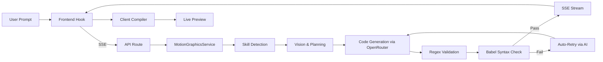
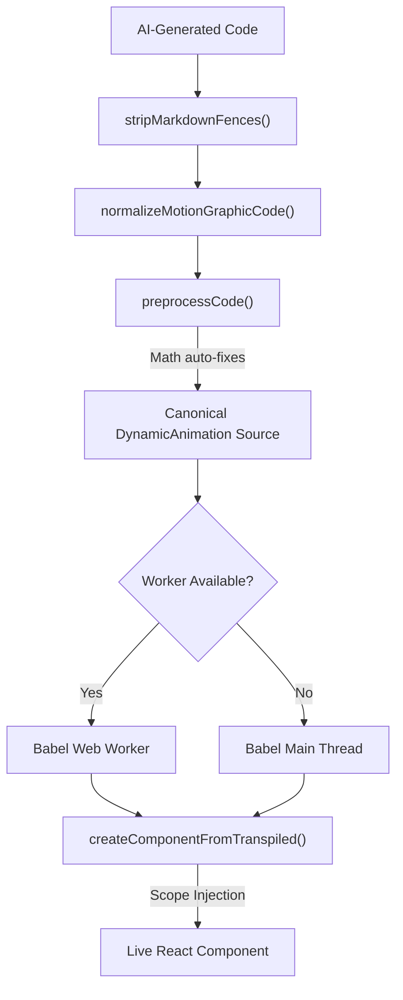

# Motion Graphics Generation — Technical Reference

> Comprehensive technical documentation for the AI-powered motion graphics system in Video Editor V2.
> This document covers the full pipeline from user prompt to rendered animation.

---

## Table of Contents

1. [Architecture Overview](#architecture-overview)
2. [Generation Pipeline](#generation-pipeline)
3. [Service Layer](#service-layer)
4. [Skill System](#skill-system)
5. [AI Prompts & Planning](#ai-prompts--planning)
6. [Code Validation](#code-validation)
7. [Client-Side Compiler](#client-side-compiler)
8. [API Routes](#api-routes)
9. [Visual Quality Check (QC)](#visual-quality-check-qc)
10. [Template System](#template-system)
11. [Type System](#type-system)
12. [Runtime Scope & Available APIs](#runtime-scope--available-apis)
13. [Error Handling & Auto-Correction](#error-handling--auto-correction)
14. [Follow-Up Editing](#follow-up-editing)
15. [File Reference](#file-reference)

---

## Architecture Overview

The motion graphics system transforms natural-language prompts into fully animated Remotion components that render directly in the browser-based video editor. The architecture spans both **server-side** (Next.js API routes + AI service) and **client-side** (React hooks, Babel compiler, runtime scope injection).



### Key Design Principles

| Principle                     | Description                                                                                                                   |
| ----------------------------- | ----------------------------------------------------------------------------------------------------------------------------- |
| **Streaming-first**           | Code is streamed via SSE for progressive preview                                                                              |
| **Skill-augmented prompts**   | 26 domain-specific skill files inject specialized knowledge into the AI context                                               |
| **Auto-correction**           | Server-side Babel check with up to 2 auto-retries + client-side fallback with up to 3 retries                                 |
| **Self-contained components** | Generated code is fully self-contained — no external dependencies beyond the injected scope                                   |
| **Deterministic rendering**   | All code must use Remotion's `random()` instead of `Math.random()`, no `useState`/`useEffect` (except for async data loading) |

---

## Generation Pipeline

The core pipeline executes in 5 stages, orchestrated by [MotionGraphicsService](file:///c:/Users/owen/Desktop/Projects/Vid-Bolt/web/lib/services/motion-graphics/motion-graphics-service.ts):

### Stage 1 — Prompt Validation & Skill Detection

1. **Local validation**: Rejects empty/too-short prompts (no API call).
2. **Keyword-based skill detection**: Scans the prompt for keywords mapped to 26 skill categories. Fast, zero latency.
3. **AI fallback**: If no keywords match, falls back to a classification model (Gemini Flash) to detect relevant skills.
4. `spring-physics` is always injected as a baseline skill.
5. Skills are prioritized: domain-specific skills (`maps`, `charts`, `3d`, `lottie`, `audio-visualization`) take precedence over generic enhancement skills.
6. Maximum of **5 skills** to keep context focused.

### Stage 2 — Vision & Planning (Conditional)

Only triggered for **complex prompts** (>12 words, contains multiple concepts, timing words, detailed requests, or animation detail):

1. **Vision Analysis**: A non-streaming call to the AI produces a 2-3 sentence description of the animation concept.
2. **Plan Creation**: A second call generates a structured JSON plan containing:
   - **Elements**: Every visual object with name, type, description, and initial state
   - **Timeline**: Frame-by-frame phases with specific animations (element, property, from/to, easing)
   - **Timing**: Total duration in frames at 30fps
   - **Style**: Background color, color palette, font, and mood

Simple prompts (e.g., "bouncy hello world") skip directly to code generation.

### Stage 3 — System Prompt Assembly

The final system prompt is assembled from:

- `BASE_SYSTEM_PROMPT` — Core Remotion rules, component structure, animation patterns, available imports, icon usage, syntax rules, and output format requirements
- **Skill content** — Combined markdown from detected skills, injected under `## SKILL-SPECIFIC GUIDANCE`
- **Plan context** — If vision/planning ran, the structured specification is appended as `## ANIMATION SPECIFICATION`
- **Error correction context** — If this is a retry attempt, the specific error and fix guidance

### Stage 4 — Streamed Code Generation

- Code is streamed from OpenRouter via SSE with `max_tokens: 32000` and `temperature: 0.7`.
- Each chunk is forwarded to the frontend as a `code_chunk` SSE event containing both the chunk and accumulated full code.

### Stage 5 — Finalization & Validation

1. **Strip markdown fences**: Removes any ` ```tsx ` wrappers.
2. **Extract component code**: Removes wrapper functions, imports, and extracts just the main `export const` component.
3. **Regex-based validation** via `validateCode()` in [code-validator.ts](file:///c:/Users/owen/Desktop/Projects/Vid-Bolt/web/lib/services/motion-graphics/code-validator.ts):
   - Syntax auto-fixes (unbalanced braces/parens, common API name corrections)
   - Reserved name checks
   - Remotion-specific checks (Math.random, CSS animations, useState/useEffect)
4. **Babel syntax check** via `transpileCheck()` — uses `@babel/parser` to parse TSX in ~1-2ms, catching **all** syntax errors:
   - Detects whether the code is module-level (has `export`) or a component body, and parses accordingly.
   - If the check fails, auto-retries **once** via `handleFollowUpEdit` with the specific error context — all within the same SSE stream. The client never sees broken code.
   - If the retry also fails, sends the code with errors flagged in the validation event (frontend safety net handles it).
5. **Icon extraction**: Scans for lucide-react icon usage (informational — all icons are injected on the client).
6. Sends `complete` SSE event with the final code, skills, icon metadata, and correction info.

---

## Service Layer

### MotionGraphicsService

**File**: [motion-graphics-service.ts](file:///c:/Users/owen/Desktop/Projects/Vid-Bolt/web/lib/services/motion-graphics/motion-graphics-service.ts)

Singleton class that orchestrates the entire generation pipeline. Key methods:

| Method                       | Purpose                                                                               |
| ---------------------------- | ------------------------------------------------------------------------------------- |
| `streamGeneration()`         | Main entry point — coordinates all 5 pipeline stages and writes SSE events            |
| `detectSkills()`             | Keyword-based skill detection with AI fallback                                        |
| `detectSkillsFromKeywords()` | Fast keyword scan against 24 skill→keyword mappings                                   |
| `analyzeVision()`            | AI call to describe the animation concept (JSON response)                             |
| `createPlan()`               | AI call to produce a structured animation specification (JSON)                        |
| `formatPlanContext()`        | Converts the plan JSON into a markdown prompt section                                 |
| `handleFollowUpEdit()`       | Handles modification requests on existing code (targeted edits or full replacement)   |
| `applyEdits()`               | Applies search-and-replace edit operations with exact + fuzzy matching                |
| `finalizeGeneration()`       | Runs regex + Babel validation, auto-retries on syntax errors, sends completion events |
| `isComplexPrompt()`          | Heuristic to determine if vision/planning should run                                  |
| `getClassificationModel()`   | Selects a cheaper model (Gemini Flash) for classification tasks                       |
| `parseAIJson()`              | Robust JSON parser with code block extraction and truncated JSON repair               |

### OpenRouter Integration

Two communication modes with the OpenRouter API:

- **Non-streaming** (`callOpenRouter`): For vision analysis, planning, skill detection, and follow-up edits. Uses `fetch()` with configurable temperature, max tokens, and optional `response_format: json_object`.
- **Streaming** (`streamOpenRouter`): Async generator for code generation. Yields content chunks from SSE stream.

### Conversation History

Follow-up edits include conversation history, truncated to **4 messages** (first + last 3) to prevent context rot.

---

## Skill System

### Overview

Skills are markdown files with YAML frontmatter stored in [web/lib/services/motion-graphics/skills/](file:///c:/Users/owen/Desktop/Projects/Vid-Bolt/web/lib/services/motion-graphics/skills). They provide domain-specific knowledge injected into the AI's system prompt.

### SkillLoader

**File**: [skill-loader.ts](file:///c:/Users/owen/Desktop/Projects/Vid-Bolt/web/lib/services/motion-graphics/skill-loader.ts)

Singleton that loads all `.md` files from the skills directory at server startup:

- Parses YAML frontmatter (name, description, tags) using `gray-matter`
- Caches skill content in a `Map<string, SkillEntry>`
- Thread-safe initialization with promise deduplication

Key methods: `getCombinedSkillContent(names)`, `getAllSkillMetadata()`, `hasSkill(name)`

### Complete Skill Catalog (26 Skills)

| Skill                   | Description                              | Key Capabilities                                                                                                                                                  |
| ----------------------- | ---------------------------------------- | ----------------------------------------------------------------------------------------------------------------------------------------------------------------- |
| **core**                | Core Remotion patterns — always included | Component structure, spring/interpolate patterns, stagger, layout, end-hold padding                                                                               |
| **spring-physics**      | Spring animations & natural motion       | 5 spring presets (smooth, snappy, bouncy, gentle, wobbly), overshoot, chained springs, shake/wiggle, elastic pull                                                 |
| **animations**          | General animation patterns               | Entrance/exit animations, looping, multi-step sequences                                                                                                           |
| **timing**              | Easing curves & interpolation            | Custom bezier curves, Easing functions, clamping rules                                                                                                            |
| **sequencing**          | Scene sequencing                         | `Sequence`, `Series`, `Series.Sequence` with offset for overlapping                                                                                               |
| **transitions**         | Scene transitions                        | `TransitionSeries`, `fade`, `slide`, `wipe`, `flip`, `clockWipe`, `linearTiming`, `springTiming`                                                                  |
| **text-animations**     | Kinetic typography                       | Typewriter, word-by-word reveal, character animation, highlight effects                                                                                           |
| **charts**              | Data visualization                       | Bar charts, pie charts, line graphs, progress bars, counter animations, axis labels                                                                               |
| **maps**                | Geographic map animations (d3-geo)       | World maps, country borders, city markers, route lines, rotating globes, sub-national data for 240 countries, 12 async geo layers (rivers, lakes, airports, etc.) |
| **3d**                  | Three.js 3D scenes                       | `ThreeCanvas`, rotating objects, camera movement, lighting setups, wireframe mode                                                                                 |
| **shapes**              | Geometric shapes                         | `Rect`, `Circle`, `Triangle`, `Star`, `Polygon`, `Ellipse`, `Heart`, `Pie` from `@remotion/shapes`                                                                |
| **social-media**        | Social media formats                     | Instagram/TikTok/YouTube layouts, story formats, vertical video                                                                                                   |
| **messaging**           | Chat/messaging UI                        | iMessage, WhatsApp, SMS bubble animations, conversation flows                                                                                                     |
| **fonts**               | Custom typography                        | Google Fonts loading patterns                                                                                                                                     |
| **images**              | Image handling                           | `Img` component, image animation patterns                                                                                                                         |
| **videos**              | Video embedding                          | `Video` from `@remotion/media`, clip handling                                                                                                                     |
| **audio**               | Audio integration                        | `Audio` from `@remotion/media`, soundtrack timing                                                                                                                 |
| **audio-visualization** | Audio visualizers                        | Spectrum, waveform, equalizer, beat-reactive animations                                                                                                           |
| **gifs**                | Animated images                          | `AnimatedImage` for GIF, APNG, AVIF, WebP synced to timeline                                                                                                      |
| **lottie**              | Lottie animations                        | `Lottie` from `@remotion/lottie`, After Effects imports                                                                                                           |
| **compositions**        | Composition setup                        | Dimensions, FPS, resolution, aspect ratio configuration                                                                                                           |
| **assets**              | Static file handling                     | `staticFile()`, font loading, asset management                                                                                                                    |
| **parameters**          | Configurable properties                  | Zod schemas, `getInputProps()`, parameterized components                                                                                                          |
| **measuring-text**      | Text measurement                         | Text overflow handling, fit-to-width, truncation                                                                                                                  |
| **trimming**            | Clip trimming                            | Clip range control, start/end frame adjustments                                                                                                                   |
| **transparent-videos**  | Alpha channel video                      | Transparent overlays, green screen compositing                                                                                                                    |

### Skill Detection Keywords

Each skill maps to a set of trigger keywords. Examples:

```
maps     → map, mapbox, location, route, geography, travel, marker, globe, flight, country, world, city, state, province
charts   → chart, graph, bar, pie, data, visualization, statistics, progress, percentage, histogram, metric
3d       → 3d, three, cube, sphere, rotate, spatial, dimension, threejs
messaging → chat, message, bubble, whatsapp, imessage, sms, conversation, dm
```

### Skill Priority

Skills are prioritized to prevent context overflow:

1. **Always included**: `spring-physics`
2. **Domain-specific** (highest priority): `maps`, `charts`, `3d`, `lottie`, `audio-visualization`
3. **Generic enhancements**: Everything else
4. **Cap**: Maximum 5 skills per generation

---

## AI Prompts & Planning

**File**: [prompts.ts](file:///c:/Users/owen/Desktop/Projects/Vid-Bolt/web/lib/services/motion-graphics/prompts.ts) (836 lines)

### BASE_SYSTEM_PROMPT

The foundation prompt (~450 lines) covering:

- **Remotion Framework Rules**: `useCurrentFrame()` for all animation, no CSS animations, `random()` for determinism, `spring()` for natural motion, clamped `interpolate()`, `Sequence`/`Series` for timing
- **Determinism**: Strict prohibition of `Math.random()`, `useState()`, `useEffect()`
- **Component Structure**: Self-contained code, no external references, specific ordering (imports → hooks → constants → helpers → calculations → JSX)
- **Available Imports**: Complete list of all APIs available in scope (Remotion core, shapes, transitions, 3D, Lottie, d3-geo, geo data, React hooks)
- **Lucide Icons**: 5000+ icons available, must use real names only
- **Syntax Rules**: 7-point checklist for brace matching, JSX attributes, style objects, tag closing, parentheses, strings, ternary operators
- **Completion Requirements**: Code must be complete, never truncated, must end with `};`

### VISION_PROMPT

Short prompt that produces a JSON `{ "description": "..." }` — 2-3 sentence description of the animation concept. Max 400 characters.

### PLANNING_PROMPT

Detailed prompt (~160 lines) that produces a structured JSON plan:

- Duration calculation rules (shorter is better: 60-90 frames for titles, 90-120 for interactions)
- Element limit: max 5 elements
- Timeline limit: max 5 phases
- Style specification: colors, fonts, mood

### FOLLOW_UP_SYSTEM_PROMPT

Handles iterative edits with two modes:

- **Targeted edits** (`type: "edit"`): For changes affecting <30% of code — uses search-and-replace operations with exact `old_string` → `new_string`
- **Full replacement** (`type: "full"`): For major restructuring (>50% changes)

### Error Correction Context

`buildErrorCorrectionContext()` analyzes the specific error type and provides targeted fix guidance:

- **Unexpected token**: Brace/paren balancing checklist
- **Unterminated string**: Quote closure guidance
- **Undefined reference**: Import list reference
- **Unexpected EOF**: Component completion instructions

---

## Code Validation

### Server-Side Validator

**File**: [code-validator.ts](file:///c:/Users/owen/Desktop/Projects/Vid-Bolt/web/lib/services/motion-graphics/code-validator.ts)

#### validateCode()

Produces a `ValidationResult` with `isValid`, `errors`, `warnings`, `fixedCode`, and `corrections`:

**Auto-Fixes Applied**:

- Unbalanced braces/parens (adds missing closers)
- Duplicate semicolons cleanup
- API name corrections:
  - `interpolateColor()` → `interpolateColors()`
  - `useFrame()` → `useCurrentFrame()`
  - `useConfig()` → `useVideoConfig()`
  - `Math.random()` → `random(null)`

**Structural Checks**:

- Component must have `export const` + arrow function with `return`
- Reserved name shadowing detection (`spring`, `interpolate`, `random`, etc.)
- Brace/paren/bracket balance validation

**Remotion-Specific Checks**:

- `Math.random()` detection
- CSS `@keyframes`, `animation:`, `transition:` detection
- `useState`/`useEffect` warnings
- `Video`/`Audio` import source validation

#### transpileCheck()

Babel-based syntax validation using `@babel/parser` in ~1-2ms:

- Strips imports (they're decorative — runtime injects everything)
- Detects module-level code (any `export` keyword present) vs. component body
  - Module code → parsed directly as a module
  - Component body → wrapped in `const DynamicAnimation = () => { ... }` before parsing
- Returns precise line/column error locations

#### extractAndEnsureIcons()

Scans code for icon usage (informational — all icons are injected on client):

- Parses `import { ... } from "lucide-react"` statements
- Scans for PascalCase words matching real lucide icon names
- Adds/updates `// ICONS:` comment in code

---

## Client-Side Compiler

**File**: [remotion-compiler.tsx](file:///c:/Users/owen/Desktop/Projects/Vid-Bolt/web/features/video-editor-v2/utils/remotion-compiler.tsx) (928 lines)

### Compilation Pipeline



### Code Extraction

`normalizeMotionGraphicCode()` accepts either a component body or a full TSX module and emits canonical source that always defines `DynamicAnimation`:

1. Removes `// ICONS:` comments
2. Removes ALL import statements (6 import patterns handled)
3. Removes redundant `export default ...` syntax
4. Extracts module-style components like `export const X = () => { ... }` or `const X = () => { ... }; export default X;`
5. Preserves helper functions/constants defined before the component

### Preprocessing

`preprocessCode()` applies auto-fixes before Babel and only wraps true body-only snippets:

- Bare Math function calls → prefixed with `Math.` (e.g., `floor()` → `Math.floor()`)
- Handles 15 Math functions: `floor`, `ceil`, `round`, `abs`, `min`, `max`, `sin`, `cos`, `tan`, `sqrt`, `pow`, `atan2`, `asin`, `acos`

### Transpilation

Two compilation paths:

1. **Web Worker** (preferred): Non-blocking Babel transpilation in a dedicated worker
2. **Main Thread Fallback**: Direct `@babel/standalone` usage if worker fails or isn't available

Both use presets: `['react', 'typescript']`

### Scope Injection

`createComponentFromTranspiled()` uses `new Function()` to create the component with **all APIs injected as parameters**:

- **Remotion Core** (14): `AbsoluteFill`, `interpolate`, `interpolateColors`, `useCurrentFrame`, `useVideoConfig`, `spring`, `Sequence`, `Img`, `Easing`, `Series`, `random`, `AnimatedImage`, `delayRender`, `continueRender`
- **React Hooks** (5): `useState`, `useEffect`, `useMemo`, `useRef`, `useCallback`
- **Shapes** (16): 8 components + 8 `make*` factory functions
- **Transitions** (7): `TransitionSeries`, `linearTiming`, `springTiming`, `fade`, `slide`, `wipe`, `flip`, `clockWipe`
- **d3-geo** (6): `geoPath`, `geoMercator`, `geoOrthographic`, `geoNaturalEarth1`, `geoEquirectangular`, `geoGraticule`
- **Geo Data** (17): `WorldCountries`, `WorldLand`, `loadCities`, `getCityCoords`, `getCityInfo`, `getSubNationalData`, `SUPPORTED_SUBNATIONAL_COUNTRIES`, plus 10 async geo layer loaders
- **Lucide Icons** (~5000): Every icon from `lucide-react` injected by name
- **3D** (optional): `ThreeCanvas`, `THREE`
- **Lottie** (optional): `Lottie`
- **Utilities**: `React`, `Math`

### Icon Resolution

- All icons pre-loaded at module init via `getAllIcons()` from `lucide-react`
- `getIcon(name)` resolves icons with fallbacks: exact name → `+Icon` suffix → `-Icon` suffix → `PlaceholderIcon`
- `PlaceholderIcon` renders a warning circle SVG

### Error Recovery

`tryFixCodeFromError()` attempts 5 categories of automated fixes:

1. **Unexpected token**: Balance braces/parens/brackets, fix unclosed JSX attributes
2. **Unterminated string**: Close unclosed quotes on the error line
3. **Unexpected EOF**: Add missing component ending
4. **Missing semicolon**: Add semicolons at error line
5. **Style object issues**: Fix `style={{ ... }` → `style={{ ... }}`

---

## API Routes

### POST /api/motion-graphics/generate

**File**: [generate/route.ts](file:///c:/Users/owen/Desktop/Projects/Vid-Bolt/web/app/api/motion-graphics/generate/route.ts) (172 lines)

SSE streaming endpoint with 5-minute timeout (`maxDuration: 300`).

**Authentication**: Supabase session via cookies
**API Key**: `x-openrouter-key` header OR fetched from `user_api_keys` database table

**Request Body**:

```typescript
{
  prompt: string;
  model: string;
  currentCode?: string;         // For follow-up edits
  conversationHistory?: Array;  // For follow-up context
  isFollowUp?: boolean;
  errorCorrection?: {           // For auto-retry
    error: string;
    attemptNumber: number;
    maxAttempts: number;
  };
  previouslyUsedSkills?: string[];
}
```

**SSE Event Types**:

| Event        | Payload                      | Description                                        |
| ------------ | ---------------------------- | -------------------------------------------------- |
| `stage`      | `{ stage, message }`         | Pipeline progress updates                          |
| `skills`     | `{ skills, newSkills }`      | Detected skill categories                          |
| `vision`     | `{ vision }`                 | Legacy vision analysis result                      |
| `plan`       | `{ plan }`                   | Animation plan (title, elements, phases, duration) |
| `code_chunk` | `{ chunk, fullCode }`        | Streamed code content                              |
| `edit`       | `{ summary, editType }`      | Follow-up edit result                              |
| `validation` | `{ result }`                 | Server-side code validation                        |
| `complete`   | `{ code, skills, metadata }` | Final generated code                               |
| `error`      | `{ error, errorType }`       | Error event                                        |
| `done`       | —                            | Stream complete signal                             |

> [!NOTE]
> When a Babel syntax error is detected during finalization, the server sends a `stage` event with `stage: 'regenerating'` before auto-retrying. The stream continues seamlessly — the client sees the progress update but never receives the broken code.

---

## Visual Quality Check (QC)

**File**: [visual-qc/route.ts](file:///c:/Users/owen/Desktop/Projects/Vid-Bolt/web/app/api/motion-graphics/visual-qc/route.ts) (329 lines)

### POST /api/motion-graphics/visual-qc

Post-generation quality analysis using a **vision-capable AI model** to evaluate screenshots of the rendered animation.

**Input**: Base64 screenshots (at 0.5s intervals) + original prompt + source code (truncated to 6000 chars)

**Evaluation Checklist**:

1. **Element Completeness**: Every requested element must be visually present
2. **Render Failure**: Blank frames, error messages, or raw code = FAIL
3. **Visual Bugs**: Text overflow, incorrect overlaps, off-canvas elements, invisible elements
4. **Layering & Z-Order**: Labels above backgrounds, markers above map backgrounds
5. **Animation Exists**: Frames must show different visual states

**Output Format**:

```typescript
{
  passed: boolean;
  elementIssues: Array<{
    elementId: string;        // Variable/constant name from code
    elementDescription: string;
    issue: string;
    severity: "critical" | "major" | "minor";
    suggestedFix: string;     // Code-level fix suggestion
  }>;
  generalIssues: string[];
  summary: string;
}
```

**Vision Model Selection**: Automatically selects a vision-capable model. Falls back to `google/gemini-3-flash-preview` if the user's selected model doesn't support vision. Supported models include GPT-4o, Claude 3.5 Sonnet, and Gemini variants.

---

## Template System

### Built-In Templates

**Directory**: [web/features/video-editor-v2/templates/motion-graphics-templates/](file:///c:/Users/owen/Desktop/Projects/Vid-Bolt/web/features/video-editor-v2/templates/motion-graphics-templates)

Four template categories with pre-built Remotion code:

| Category       | File                                                                                                                                                    | Description                                           |
| -------------- | ------------------------------------------------------------------------------------------------------------------------------------------------------- | ----------------------------------------------------- |
| Lower Thirds   | [lower-thirds.ts](file:///c:/Users/owen/Desktop/Projects/Vid-Bolt/web/features/video-editor-v2/templates/motion-graphics-templates/lower-thirds.ts)     | Name/title overlays for broadcast-style presentations |
| Title Cards    | [title-cards.ts](file:///c:/Users/owen/Desktop/Projects/Vid-Bolt/web/features/video-editor-v2/templates/motion-graphics-templates/title-cards.ts)       | Full-screen title sequences                           |
| Call to Action | [call-to-action.ts](file:///c:/Users/owen/Desktop/Projects/Vid-Bolt/web/features/video-editor-v2/templates/motion-graphics-templates/call-to-action.ts) | Subscribe buttons, like banners, engagement prompts   |
| Map Animations | [map-animations.ts](file:///c:/Users/owen/Desktop/Projects/Vid-Bolt/web/features/video-editor-v2/templates/motion-graphics-templates/map-animations.ts) | Geographic animations with Mapbox                     |

Templates are searchable by name, description, and tags via `searchTemplates()`.

### Template Architecture (New vs Legacy)

The system has two architectures:

```
NEW (Single Source of Truth):
  compositionDefinition → CompositionRenderer → Live Preview
  compositionDefinition → serializeToRemotionCode() → Export

LEGACY:
  remotionCode → Babel Compiler → Live Preview + Export
```

- `compositionDefinition` (structured layers) is the primary source of truth for new AI-generated content
- `remotionCode` (raw Remotion JSX) is optional/legacy, used for built-in templates and export

---

## Type System

**File**: [motion-graphics.ts](file:///c:/Users/owen/Desktop/Projects/Vid-Bolt/web/features/video-editor-v2/types/motion-graphics.ts) (462 lines)

### Core Types

| Type                             | Purpose                                                                                             |
| -------------------------------- | --------------------------------------------------------------------------------------------------- |
| `MotionGraphicsTemplate`         | Full template definition (name, category, duration, properties, code, mapbox config)                |
| `MotionGraphicsOverlay`          | Timeline overlay instance with template reference and property overrides                            |
| `EditableProperty`               | Inspector-editable property (text, color, number, select, font, location, boolean, image, gradient) |
| `MapboxConfig`                   | Geographic map configuration (center, zoom, style, markers, routes, animation type)                 |
| `ChatMessage`                    | AI conversation message with optional generated template                                            |
| `GenerateMotionGraphicsRequest`  | API request shape for generation                                                                    |
| `GenerateMotionGraphicsResponse` | API response shape                                                                                  |
| `MotionGraphicsState`            | Zustand store state slice                                                                           |
| `MotionGraphicsActions`          | Store action methods                                                                                |

### Categories

```typescript
enum MotionGraphicsCategory {
  TEXT_ANIMATION,
  LOWER_THIRD,
  TITLE_CARD,
  CALL_TO_ACTION,
  MAP_ANIMATION,
  DATA_VISUALIZATION,
  SOCIAL_MEDIA,
  COUNTDOWN,
  LOGO_REVEAL,
  CUSTOM,
}
```

### Mapbox Animation Types

```typescript
type MapboxAnimationType =
  | "flyTo" // Cinematic flight between locations
  | "route" // Animated path along a route
  | "markers" // Sequential marker animations
  | "static" // Static map with optional overlays
  | "zoom" // Dramatic zoom in/out
  | "pan" // Smooth pan across a region
  | "reveal"; // Reveal animation with effects
```

---

## Runtime Scope & Available APIs

The compiler injects the following into the generated component's scope at runtime:

### Remotion Core

`AbsoluteFill`, `interpolate`, `interpolateColors`, `useCurrentFrame`, `useVideoConfig`, `spring`, `Sequence`, `Img`, `Easing`, `Series`, `random`, `AnimatedImage`, `delayRender`, `continueRender`, `cancelRender`

### React

`useState`, `useEffect`, `useMemo`, `useRef`, `useCallback`

### Shapes (@remotion/shapes)

`Rect`, `Circle`, `Triangle`, `Star`, `Polygon`, `Ellipse`, `Heart`, `Pie` + `makeRect`, `makeCircle`, `makeTriangle`, `makeStar`, `makePolygon`, `makeEllipse`, `makeHeart`, `makePie`

### Transitions (@remotion/transitions)

`TransitionSeries`, `linearTiming`, `springTiming`, `fade`, `slide`, `wipe`, `flip`, `clockWipe`

### Geographic (d3-geo + Custom)

`geoPath`, `geoMercator`, `geoOrthographic`, `geoNaturalEarth1`, `geoEquirectangular`, `geoGraticule`, `WorldCountries`, `WorldLand`, `loadCities`, `getCityCoords`, `getCityInfo`, `getSubNationalData`, `SUPPORTED_SUBNATIONAL_COUNTRIES`

### Geo Layers (Async Loaders)

`loadRivers`, `loadLakes`, `loadOceans`, `loadAirports`, `loadPorts`, `loadUrbanAreas`, `loadTimezones`, `loadCoastlines`, `loadGeographicLines`, `loadGlaciated`, `loadReefs`

### Icons

~5000 icons from `lucide-react` — all injected by PascalCase name (e.g., `Bell`, `Heart`, `TrendingUp`)

### Optional (if installed)

`ThreeCanvas` (@remotion/three), `THREE` (three.js), `Lottie` (@remotion/lottie)

---

## Error Handling & Auto-Correction

### Server-Side Auto-Retry (Primary)

The backend `finalizeGeneration()` method in [motion-graphics-service.ts](file:///c:/Users/owen/Desktop/Projects/Vid-Bolt/web/lib/services/motion-graphics/motion-graphics-service.ts) runs a Babel syntax check on every generated code before sending it to the client:

1. After regex validation, `transpileCheck()` parses the code with `@babel/parser` (~1-2ms)
2. If the parse fails, the service auto-retries **once** by calling `handleFollowUpEdit` with the specific syntax error — all within the same SSE stream
3. Only initial generation (`streamGeneration`) passes retry context — follow-up edits do **not** re-retry (prevents infinite loops)
4. The client never sees intermediate broken code
5. If the retry also fails, the code is sent with errors flagged — the frontend safety net handles it

### Client-Side Auto-Retry (Belt-and-Suspenders)

The frontend hook [use-motion-graphics-generation.ts](file:///c:/Users/owen/Desktop/Projects/Vid-Bolt/web/features/video-editor-v2/hooks/use-motion-graphics-generation.ts) implements a secondary error correction layer:

1. After receiving the `complete` event, client-side `validateCodeAsync()` runs a full Babel compilation check
2. If validation fails, the hook **recursively calls itself** with `errorCorrection` context
3. Maximum **3 auto-correction attempts** (configurable via `maxAutoCorrectAttempts`)
4. Each retry sends the failed code + specific error message back to the AI
5. Attempt count tracked via `useRef` for synchronous accuracy (not `useState`)
6. Vision duration is preserved across retries via `visionDurationRef`

### Error Types

| Type          | Source                 | Handling                                            |
| ------------- | ---------------------- | --------------------------------------------------- |
| `validation`  | Local prompt check     | Immediate rejection, no API call                    |
| `api`         | OpenRouter / network   | Displayed to user                                   |
| `compilation` | Babel transpilation    | Auto-retry with error context                       |
| `edit_failed` | Follow-up edit failure | Falls back to full replacement, then displays error |

### Generation Stages (UI Feedback)

```typescript
type GenerationStage =
  | "idle"
  | "starting"
  | "validating"
  | "analyzing"
  | "intent_analysis"
  | "skill_selection"
  | "planning"
  | "generating"
  | "editing"
  | "visual_qc"
  | "regenerating"
  | "complete"
  | "error";
```

---

## Follow-Up Editing

The system supports iterative modification of existing motion graphics via conversational follow-ups.

### Edit Decision

The AI analyzes the request and decides between:

- **Targeted edits** (<30% change): JSON array of `{ old_string, new_string, description }` operations
- **Full replacement** (>50% change): Complete new code

### Edit Application

`applyEdits()` uses a two-strategy matching approach:

1. **Exact match**: Character-for-character match of `old_string`
2. **Fuzzy match**: Whitespace-normalized matching — collapses all whitespace to single spaces, finds the match in normalized space, maps back to original character positions

Ambiguous matches (multiple occurrences) are rejected to prevent unintended edits.

### Fallback Mechanism

If targeted editing fails (match not found), the service automatically retries with a full replacement request — the user never sees the intermediate failure.

---

## File Reference

| File                                                                                                                                                      | Location                                   | Purpose                                                |
| --------------------------------------------------------------------------------------------------------------------------------------------------------- | ------------------------------------------ | ------------------------------------------------------ |
| [motion-graphics-service.ts](file:///c:/Users/owen/Desktop/Projects/Vid-Bolt/web/lib/services/motion-graphics/motion-graphics-service.ts)                 | `web/lib/services/motion-graphics/`        | Core AI pipeline orchestration                         |
| [prompts.ts](file:///c:/Users/owen/Desktop/Projects/Vid-Bolt/web/lib/services/motion-graphics/prompts.ts)                                                 | `web/lib/services/motion-graphics/`        | All system prompts (base, follow-up, vision, planning) |
| [code-validator.ts](file:///c:/Users/owen/Desktop/Projects/Vid-Bolt/web/lib/services/motion-graphics/code-validator.ts)                                   | `web/lib/services/motion-graphics/`        | Server-side code validation and auto-fixes             |
| [skill-loader.ts](file:///c:/Users/owen/Desktop/Projects/Vid-Bolt/web/lib/services/motion-graphics/skill-loader.ts)                                       | `web/lib/services/motion-graphics/`        | Skill markdown file loader (singleton)                 |
| [skills/](file:///c:/Users/owen/Desktop/Projects/Vid-Bolt/web/lib/services/motion-graphics/skills)                                                        | `web/lib/services/motion-graphics/skills/` | 26 skill files (core, maps, charts, 3d, etc.)          |
| [remotion-compiler.tsx](file:///c:/Users/owen/Desktop/Projects/Vid-Bolt/web/features/video-editor-v2/utils/remotion-compiler.tsx)                         | `web/features/video-editor-v2/utils/`      | Client-side Babel compiler with scope injection        |
| [use-motion-graphics-generation.ts](file:///c:/Users/owen/Desktop/Projects/Vid-Bolt/web/features/video-editor-v2/hooks/use-motion-graphics-generation.ts) | `web/features/video-editor-v2/hooks/`      | React hook for generation (SSE consumer, auto-retry)   |
| [motion-graphics.ts](file:///c:/Users/owen/Desktop/Projects/Vid-Bolt/web/features/video-editor-v2/types/motion-graphics.ts)                               | `web/features/video-editor-v2/types/`      | Type definitions                                       |
| [generate/route.ts](file:///c:/Users/owen/Desktop/Projects/Vid-Bolt/web/app/api/motion-graphics/generate/route.ts)                                        | `web/app/api/motion-graphics/generate/`    | SSE streaming API endpoint                             |
| [visual-qc/route.ts](file:///c:/Users/owen/Desktop/Projects/Vid-Bolt/web/app/api/motion-graphics/visual-qc/route.ts)                                      | `web/app/api/motion-graphics/visual-qc/`   | Vision-based quality check endpoint                    |
| [templates/motion-graphics-templates/](file:///c:/Users/owen/Desktop/Projects/Vid-Bolt/web/features/video-editor-v2/templates/motion-graphics-templates)  | `web/features/video-editor-v2/templates/`  | Built-in template definitions                          |
