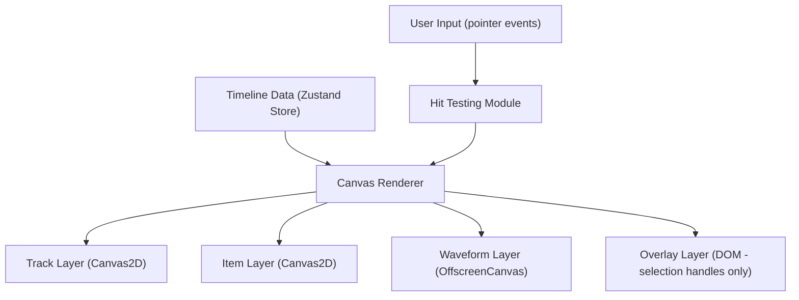

# Commercial-Grade Performance Optimization Plan

Five independent workstreams, ordered by impact/effort ratio. Each can be assigned to a sub-agent.

---

## Workstream 1: Inspector Lazy-Mount Tabs

**Goal:** Stop mounting all 5 inspector tabs simultaneously. Only mount the active tab.  
**Effort:** 2-3 hours | **Impact:** -500+ DOM nodes, -200ms mount time

### Problem

[inspector-panel.tsx](file:///c:/Users/owen/Desktop/Projects/Vid-Bolt/web/features/video-editor-v2/components/inspector/inspector-panel.tsx) renders 5 `<TabsContent>` blocks at lines 821-1069. Radix UI's `TabsContent` mounts all tabs and uses `data-[state=inactive]:hidden` to hide them with CSS. This means all 20 section files are mounted simultaneously — that's **~500KB of component code** always in the DOM.

Heaviest sections always rendered even when hidden:

- [keyframes-section.tsx](file:///c:/Users/owen/Desktop/Projects/Vid-Bolt/web/features/video-editor-v2/components/inspector/sections/keyframes-section.tsx) — 100KB
- [effects-section.tsx](file:///c:/Users/owen/Desktop/Projects/Vid-Bolt/web/features/video-editor-v2/components/inspector/sections/effects-section.tsx) — 61KB
- [masks-section.tsx](file:///c:/Users/owen/Desktop/Projects/Vid-Bolt/web/features/video-editor-v2/components/inspector/sections/masks-section.tsx) — 47KB

### Implementation

#### [MODIFY] [inspector-panel.tsx](file:///c:/Users/owen/Desktop/Projects/Vid-Bolt/web/features/video-editor-v2/components/inspector/inspector-panel.tsx)

1. Use Radix `TabsContent` with `forceMount={false}` (or remove `forceMount` if set)
2. OR conditionally render tab content based on `activeTab` state:

```diff
-<TabsContent value="effects" className="...data-[state=inactive]:hidden...">
-  <EffectsSection ... />
-</TabsContent>
+{activeTab === "effects" && (
+  <TabsContent value="effects" className="..." forceMount>
+    <EffectsSection ... />
+  </TabsContent>
+)}
```

3. Apply this pattern to all 5 tab content blocks (lines 821-1069):
   - `properties` (line 821)
   - `style` (line 843)
   - `effects` (line 955)
   - `color` (line 1018)
   - `animation` (line 1042)

4. The `activeTab` state already exists at line 333 (`InspectorTab` enum)

### Verification

- Open DevTools → Elements → count DOM nodes with inspector open vs closed
- Switching tabs should show node count change (mounting/unmounting)
- Ensure tab switching remains snappy with no visible flash

---

## Workstream 2: CSS `content-visibility` on Panels

**Goal:** Tell the browser to skip rendering for off-screen/hidden content areas.  
**Effort:** 1 hour | **Impact:** -20-30% Recalculate style time

### Problem

Zero `content-visibility` usage across the entire editor. The browser recalculates styles for ALL DOM elements including off-screen sections inside the ScrollArea of the inspector, off-screen tracks in the timeline, and hidden panel content.

### Implementation

#### [MODIFY] [inspector-panel.tsx](file:///c:/Users/owen/Desktop/Projects/Vid-Bolt/web/features/video-editor-v2/components/inspector/inspector-panel.tsx)

Add `content-visibility: auto` and `contain-intrinsic-size` to each collapsible inspector section when collapsed:

```tsx
// In InspectorSection component (line 162)
<div
  style={{
    contentVisibility: isOpen ? "visible" : "auto",
    containIntrinsicSize: "0 200px", // Approximate collapsed height
  }}
>
  {children}
</div>
```

#### [MODIFY] [timeline-content.tsx](file:///c:/Users/owen/Desktop/Projects/Vid-Bolt/web/features/video-editor-v2/components/advanced-timeline/components/timeline-content.tsx)

Add `content-visibility: auto` to the timeline track container for tracks that are vertically scrolled off-screen:

```tsx
// In the track rendering at line 878
<div
  style={{
    contentVisibility: "auto",
    containIntrinsicSize: `auto ${trackHeight}px`,
  }}
>
  {/* track items */}
</div>
```

#### [MODIFY] [selection-handles.tsx](file:///c:/Users/owen/Desktop/Projects/Vid-Bolt/web/features/video-editor-v2/components/selection/selection-handles.tsx)

Already has `contain: layout style` from our previous fix. No additional changes needed.

### Verification

- Performance recording before/after: `Recalculate style` total time should decrease
- Visual regression: ensure nothing clips or disappears unexpectedly

---

## Workstream 3: Memoize `getClipTransitions`

**Goal:** Cache `getClipTransitionsPure` results to avoid redundant computation during renders.  
**Effort:** 1 hour | **Impact:** -30ms scripting per interaction

### Problem

[use-timeline-tracks.ts:75](file:///c:/Users/owen/Desktop/Projects/Vid-Bolt/web/features/video-editor-v2/components/advanced-timeline/hooks/use-timeline-tracks.ts#L75-L77)

```ts
const getClipTransitions = useCallback(
  (clipId: string) => {
    return getClipTransitionsPure(clipId, storeTransitions);
  },
  [storeTransitions],
);
```

This is called **per clip** during track rendering (line 88). `getClipTransitionsPure` iterates over all transitions to find matches for a given clip. For N clips × M transitions, this is O(N×M) per render.

### Implementation

#### [MODIFY] [use-timeline-tracks.ts](file:///c:/Users/owen/Desktop/Projects/Vid-Bolt/web/features/video-editor-v2/components/advanced-timeline/hooks/use-timeline-tracks.ts)

Replace per-clip lookup with a pre-computed map:

```ts
// Pre-compute a map of clipId -> transitions (O(M) once, instead of O(N×M))
const transitionsByClip = useMemo(() => {
  const map = new Map<string, { inTransition: any; outTransition: any }>();

  if (!storeTransitions) return map;

  Object.values(storeTransitions).forEach((transition: any) => {
    transition.clipIds?.forEach((clipId: string) => {
      const existing = map.get(clipId) || {
        inTransition: null,
        outTransition: null,
      };
      // Determine if this is an in or out transition based on position
      if (transition.position === "start") {
        existing.inTransition = transition;
      } else {
        existing.outTransition = transition;
      }
      map.set(clipId, existing);
    });
  });

  return map;
}, [storeTransitions]);

const getClipTransitions = useCallback(
  (clipId: string) => {
    return (
      transitionsByClip.get(clipId) || {
        inTransition: null,
        outTransition: null,
      }
    );
  },
  [transitionsByClip],
);
```

> [!NOTE]
> Check `getClipTransitionsPure` implementation first to understand the exact return shape and transition position logic. The above is a template — adapt to match the actual data model.

### Verification

- Profile Bottom-up: `getClipTransitions` should drop from 30.7ms to <5ms
- All transitions should still render correctly on timeline items

---

## Workstream 4: Timeline Item DOM Reduction

**Goal:** Reduce per-item DOM node count in the timeline.  
**Effort:** 1-2 days | **Impact:** -2,000+ DOM nodes

### Problem

Each timeline item renders 11+ sub-components (see [timeline-item directory](file:///c:/Users/owen/Desktop/Projects/Vid-Bolt/web/features/video-editor-v2/components/advanced-timeline/components/timeline-item)):

| Component                                      | DOM Nodes | Always Needed?                 |
| ---------------------------------------------- | --------- | ------------------------------ |
| `timeline-item-content.tsx`                    | 3-5       | ✅                             |
| `timeline-item-content-factory.tsx`            | 2-3       | ✅                             |
| `timeline-item-resize-handles.tsx`             | 2         | ❌ Only when hovered/selected  |
| `timeline-item-fade-overlays.tsx`              | 2-4       | ❌ Only when fades exist       |
| `timeline-item-transition-indicators.tsx`      | 2         | ❌ Only when transitions exist |
| `timeline-item-transition-overlay.tsx`         | 5-10      | ❌ Only when transitions exist |
| `timeline-item-between-transition-overlay.tsx` | 5-10      | ❌ Only when dragging          |
| `timeline-item-transition-drop-zones.tsx`      | 4-6       | ❌ Only during drag            |
| `timeline-item-split-line.tsx`                 | 1         | ❌ Only during split           |
| `timeline-item-context-menu.tsx`               | 3-5       | ❌ Only on right-click         |

### Implementation

#### [MODIFY] [timeline-item.tsx](file:///c:/Users/owen/Desktop/Projects/Vid-Bolt/web/features/video-editor-v2/components/advanced-timeline/components/timeline-item.tsx)

1. **Conditionally render resize handles** — only mount when `isHovered || isSelected`:

```tsx
{(isHovered || isSelected) && <TimelineItemResizeHandles ... />}
```

2. **Conditionally render fade overlays** — only mount when clip has fades:

```tsx
{(clip.fadeIn || clip.fadeOut) && <TimelineItemFadeOverlays ... />}
```

3. **Conditionally render transition overlays** — only mount when transitions exist:

```tsx
{hasTransitions && <TimelineItemTransitionOverlay ... />}
```

4. **Conditionally render context menu** — only mount on right-click (use state):

```tsx
{contextMenuOpen && <TimelineItemContextMenu ... />}
```

5. **Conditionally render drop zones** — only mount during active drag:

```tsx
{isDragging && <TimelineItemTransitionDropZones ... />}
```

> [!IMPORTANT]
> Check `timeline-item.tsx` (76KB) carefully — some of these may already be conditional. The sub-agent should audit each sub-component's render conditions and add guards where missing.

### Verification

- Count DOM nodes with 20+ clips: should reduce by ~40-60%
- All interactions (hover, select, resize, fade, transition, context menu) must still work
- Timeline scrubbing performance should improve measurably

---

## Workstream 5: Canvas-Based Timeline (Architecture)

**Goal:** Replace DOM-based timeline items with a Canvas2D/WebGL renderer.  
**Effort:** 2-3 weeks | **Impact:** Game-changer — 60fps with 1,000+ clips

> [!CAUTION]
> This is a **major architectural change**. It should only be undertaken after Workstreams 1-4 are complete and validated. The DOM timeline should be maintained as a fallback during development.

### Problem

The DOM-based timeline has an inherent ceiling: each clip is a `<div>` with children, and the browser must calculate layout, style, and paint for each. With 100+ clips, `Recalculate style` dominates the profile. No amount of CSS optimization can overcome this — it's a fundamental DOM limitation.

Commercial editors (CapCut, Clipchamp, DaVinci Resolve) use Canvas for their timelines. A Canvas timeline has **exactly 1 DOM node** regardless of clip count.

### Architecture



### Implementation Phases

#### Phase 1: Canvas Rendering Engine

- Create `TimelineCanvas` component wrapping a `<canvas>` element
- Implement hit testing (point-in-rect for clips, edge detection for resize handles)
- Render tracks, clips, and time ruler on canvas
- Use `requestAnimationFrame` for smooth scrolling and zooming

#### Phase 2: Interaction Layer

- Implement clip selection via canvas hit test (not DOM click handlers)
- Implement clip dragging with ghost preview rendered on canvas
- Implement resize via edge hit zones
- Use a thin DOM overlay **only** for context menus and text inputs

#### Phase 3: Waveform Rendering

- Move waveform rendering to `OffscreenCanvas` in a Web Worker
- Cache rendered waveform tiles at different zoom levels
- Composite waveform tiles onto the main canvas

#### Phase 4: Migration

- Add feature flag to toggle between DOM and Canvas timeline
- Migrate one track type at a time (start with audio tracks)
- Remove DOM timeline code after full validation

### Key Files to Create

| File                                           | Purpose                                |
| ---------------------------------------------- | -------------------------------------- |
| [NEW] `canvas-timeline/canvas-timeline.tsx`    | Main canvas component                  |
| [NEW] `canvas-timeline/renderer.ts`            | Draw calls for tracks, items, playhead |
| [NEW] `canvas-timeline/hit-test.ts`            | Point-in-rect, edge detection          |
| [NEW] `canvas-timeline/interaction-handler.ts` | Pointer event → action mapping         |
| [NEW] `canvas-timeline/waveform-worker.ts`     | OffscreenCanvas waveform renderer      |

### Verification

- Side-by-side comparison: DOM vs Canvas timeline appearance
- Performance recording: `Recalculate style` should be near-zero for timeline
- All existing timeline interactions must work identically

---

## Priority & Dependencies

```mermaid
gantt
    title Optimization Workstreams
    dateFormat X
    axisFormat %s hours

    section Tier 1 - Quick Wins
    WS2 content-visibility    :a1, 0, 1
    WS3 Memoize transitions   :a2, 0, 1
    WS1 Inspector lazy-mount  :a3, 0, 3

    section Tier 2 - Medium
    WS4 Timeline DOM reduction :b1, 3, 16

    section Tier 3 - Architecture
    WS5 Canvas timeline        :c1, 16, 160
```



| Workstream                 | Can Be Parallelized?     | Dependencies           |
| -------------------------- | ------------------------ | ---------------------- |
| WS1 Inspector lazy-mount   | ✅ Independent           | None                   |
| WS2 `content-visibility`   | ✅ Independent           | None                   |
| WS3 Memoize transitions    | ✅ Independent           | None                   |
| WS4 Timeline DOM reduction | ✅ Independent           | None                   |
| WS5 Canvas timeline        | ⚠️ After WS1-4 validated | WS4 provides learnings |

> [!TIP]
> WS1, WS2, WS3, and WS4 are fully parallelizable — assign to 4 sub-agents simultaneously.
